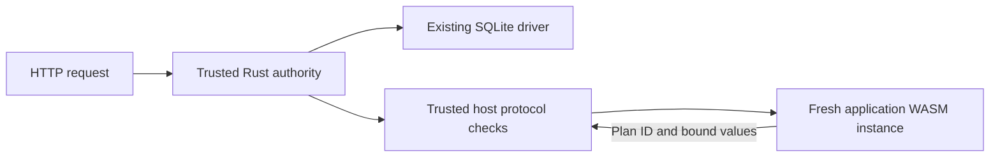

# Independent WASM authority: implementation and cost

**The independent boundary works for this fixture, but this reference-execution design is too expensive to promote.** All **1,719,296 measured HTTP requests** passed response/state/SQL checks. At 12 clients with WAL, scoped-host small reads reach **1,181 req/s versus 7,038 raw WASM and 9,327 native**. Keep this strict host as an executable correctness reference; continue the shared-Rust/native direction while designing a cheaper independently enforcing WASM boundary.

This implements the next bounded stage from the
[host trust decision](wasm-host-trust-decision.md). The earlier native/auth-policy
experiments and historical WASM candidate remain frozen. No cloud deployment,
workerd qualification, default-target switch or production migration occurred.

## What now enforces authority

The same checked Jadpo fixture generates one Rust application and contract. The
native executable runs that core directly with rusqlite. The WASM host runs a
trusted Rust authority instance plus a fresh isolated application instance per
invocation. The trusted authority runs the generated application as a **reference
execution**: it determines each expected scoped effect and final result, plans
policy-guarded SQL, validates returned data and owns transaction completion. The
guest's effects and output must match before the host proceeds or commits.



Authentication happens once, inside the trusted authority. Credentials, secret
configuration, the trusted clock and trusted principal state do not enter the
application guest. Authorized row identifiers can still appear as ordinary data;
they do not confer authority. It receives validated application input and an authority-owned
invocation scope. Its only effect vocabulary is `entity.read` / `entity.update`
with plan ID, key and permitted changes. The monitor accepts neither SQL nor
transaction commands from that guest; only the pinned authority can issue them.

Each effect is bound to the active invocation and expected operation number. The
trusted reference fixes its plan, key, changes and position in the effect sequence.
The monitor rejects changed fields/values, replay, early completion and unexpected
output. SQL predicates use the live row ownership/field policy. Completion checking
and size validation happen before the authority commits. Trap/protocol failure
rolls back any open transaction, including a first write already performed.

Restricted fields are redacted before data reaches the guest when the caller lacks
field-read permission. This prototype supports nullable protected fields and
replaces their values with null; nonnullable protected fields are rejected at
lowering. The guest still validates the resulting closed row. This does not change
the stored value or the public API. The reference completion check detects any
result mismatch caused by divergent application behavior.

A new application instance/memory is created after authentication for every
invocation. Reusing one mutable guest instance across callers would retain earlier
callers' authorized data in memory, undermining field redaction. The compiled
WebAssembly module is reused; guest linear memory and mutable globals are not.
The trusted authority instance may be reused because it is part of the host's
trusted computing base.

This is deliberately stronger and more expensive than a policy-only capability
host: **the application computation runs twice, database effects once**. It uses
one generated Rust implementation, not independently handwritten JS policy logic.
It is a useful executable reference and adversarial test target, not yet the
proposed optimized production arrangement.

## Verified behavior

The final HTTP matrix repeats **888 application requests** across Bun, new native
and scoped WASM in WAL/DELETE: 52 scenario calls plus 96 concurrent calls per server,
six servers. It checks stable status/body, cache headers/request-ID correlation,
SQL traces and committed state. Concurrent callers still execute serially on one
application database connection. The generated Bun target remains unchanged and
uses the same experiment budget wrapper as the prior comparison.

**51 source-mutation HTTP calls** verify a changed title refinement and field update
grant across all three targets. Seven unsupported plans fail before publishing
new output, including the new nonnullable-redaction restriction. Widening a
restricted field's output audience is rejected by the existing checker. Original
application, contract, both WASM modules and authority lock are restored by hash.

Additional checks passed:

- **32 authority tests / 202 assertions**, including four attacks from a separately
  compiled hostile WASM module: raw SQL, transaction commit, a different plan and a
  forged principal. These run as an editor without private-field read permission.
- Forged row IDs, SQL-looking keys, extra fields, changed write values, stale and
  cross-request handles, premature completion, forged/oversized output and traps
  after the first write. These must fail without committed application changes.
- Redaction before guest delivery; no credential/key/clock/SQL data in guest frames;
  fresh application memories and scopes; invalid high request IDs cannot poison
  later invocations; alternating principals remain isolated.
- Revocation and disabled authority checked before application entry; ownership
  changed after authentication is observed by the subsequent SQL predicate.
- Thirty row/read/write probes near the original 64 KiB limits compare with the
  frozen raw-WASM module. Only the private inter-module framing budget is 128 KiB;
  the original SQL/HTTP/application completion budgets remain 64 KiB.
- **Five native lifecycle tests**, plus four CLI unit and four CLI integration
  tests. No complete repository release gate or independent security audit ran.

The authority protocol has a bounded effect count. Extra reference/bridge effects
consume part of that bound; only this fixture's at-most-two-storage-effect request
paths are qualified. The current synchronous host has no instruction-fuel or
execution-deadline enforcement for a guest that never returns. The built guest is
limited to 8 MiB linear memory, but arbitrary replacement modules have not been
qualified against memory exhaustion. This is confidentiality/integrity evidence
for the tested boundary, **not availability isolation or sandbox certification**.

## Equivalent database work

Each authorized request still makes two session reads and one user lookup. The
new host adds no authentication/policy database reads. Across the benchmark,
statement counts must match these expectations on every measured block:

| Workload | Bun | Native | Raw WASM | Scoped WASM |
| --- | ---: | ---: | ---: | ---: |
| Authorized read | 4 | 4 | 4 | 4 |
| Single rename | 7 | 6 | 6 | 6 |
| Successful / denied pair | 13 | 7 | 7 | 7 |
| Missing credentials | 0 | 0 | 0 | 0 |

Thus scoped-versus-raw WASM comparisons have equal SQL work. Bun-versus-Rust write
comparisons still differ: generated Bun uses pre-reads/nested savepoints, while
Rust uses guarded UPDATE RETURNING and one owning transaction for propagating
failures. General handled nested savepoint recovery remains unsupported.

All connections use the same SQLite 3.39.5 here, chosen WAL/DELETE journal,
synchronous FULL, foreign keys enabled, zero busy timeout, `fullfsync=0` and
1,000-page WAL autocheckpoint. No response/identity cache or freshness relaxation
was introduced. As before, revocation is checked when authorizing each request;
this does not promise to abort an already-authorized in-flight transaction. Durability settings agree; crash/power-loss behavior was not tested.

## Performance

WAL, 12 clients. Requests/s excludes trace-drain pauses.

| Workload | Bun | Native | Raw WASM | Scoped WASM | Scoped / raw |
| --- | ---: | ---: | ---: | ---: | ---: |
| Small public read | 4,541 | 9,327 | 7,038 | 1,181 | 0.17× |
| 16 KiB row → public summary | 5,934 | 10,086 | 6,487 | 1,220 | 0.19× |
| 16 KiB private response | 4,538 | 7,935 | 4,373 | 981 | 0.22× |
| Single rename | 3,155 | 3,997 | 3,039 | 807 | 0.27× |
| Atomic pair | 2,521 | 4,138 | 3,037 | 844 | 0.28× |
| Denied second write / rollback | 3,490 | 5,654 | 3,928 | 1,082 | 0.28× |
| Missing credentials | 26,107 | 30,713 | 26,542 | 25,989 | 0.98× |

For these authorized WAL workloads the scoped host loses about 72–83% of raw-WASM throughput despite identical SQL work. Missing-auth throughput stays similar because rejection happens before guest instantiation/reference application execution. The three small-read scoped runs span 795–1,272 req/s.

Selected p95 / p99 latencies in milliseconds, WAL / 12 clients:

| Workload | Bun | Native | Raw WASM | Scoped WASM |
| --- | ---: | ---: | ---: | ---: |
| Small public read | 5.02 / 6.73 | 1.88 / 4.68 | 2.94 / 4.98 | 16.87 / 21.66 |
| 16 KiB private response | 3.59 / 7.83 | 1.74 / 2.27 | 4.61 / 6.83 | 20.76 / 25.94 |
| Atomic pair | 7.43 / 18.43 | 3.42 / 6.66 | 6.79 / 10.47 | 23.91 / 38.05 |

DELETE does not erase the overhead. For paired writes at 12 clients, median throughput is 1,188, 1,842, 1,280, 662 req/s (Bun / native / raw / scoped); scoped p95 is 30.03 ms versus raw WASM’s 15.93 ms. The complete table retains both concurrency levels, both journals and maximum latencies; no outliers are removed.

All four targets were measured in this campaign. `raw-wasm` uses the frozen
previous auth-policy module/host; `wasm` is the new scoped host. All WASM execution
is **Bun-hosted**, not workerd. The native target is the newly compiled shared core.
Bun uses the equivalent generated target and same comparison wrapper in the new
experiment. Historical absolute throughput values are not mixed into this table.

Three repetitions rotate four targets, without complete order counterbalancing.
Seven workloads × two journals × two client counts × four targets × three
repetitions give 336 cells. Each starts a fresh process/database, runs 32 warmups
then at least one second in blocks of 128 requests. Every response and final state
is checked. SQL traces are drained outside timed blocks to keep instrumentation
bounded; inclusive throughput includes those pauses. CPU includes trace drains.
Full p50/p95/p99/max distributions, raw latency arrays, CPU, RSS and repetition
ranges are retained. Reported table values are medians of per-run metrics.

The local M1 Pro / macOS development host also runs the closed-loop Node client.
Short warmups/cells, JIT and garbage collection, shared-host activity and serialized
SQL execution limit interpretation. These are not production capacity estimates,
open-loop overload results, confidence intervals or a controlled-host comparison.

## Startup, memory, build and attribution

Server CPU µs/request, including trace drains, WAL / 12 clients:

| Workload | Bun | Native | Raw WASM | Scoped WASM |
| --- | ---: | ---: | ---: | ---: |
| Small public read | 260.4 | 101.0 | 208.8 | 1703.1 |
| 16 KiB private response | 271.3 | 129.8 | 328.1 | 1865.2 |
| Atomic pair | 507.8 | 217.8 | 442.7 | 2209.8 |

Small-read scoped CPU is about 8.2× raw WASM. This includes the host/runtime, reference execution, JSON protocol, fresh instances and tracing. It is not an isolated measure of policy checking.

| Target | Small-read post-phase RSS, WAL / 12 | Largest lifetime peak, all cells | Median spawn → first response | Startup range |
| --- | ---: | ---: | ---: | ---: |
| Bun | 106.0 MiB | 148.4 MiB | 84.71 ms | 82.42–92.05 ms |
| Native | 15.0 MiB | 16.1 MiB | 7.32 ms | 6.55–9.51 ms |
| Raw WASM | 129.2 MiB | 144.7 MiB | 31.46 ms | 29.12–33.23 ms |
| Scoped WASM | 119.3 MiB | 137.4 MiB | 46.56 ms | 45.17–49.93 ms |

RSS includes the Bun host for both WASM variants; guest linear-memory ceilings are not process memory. Startup uses ten fresh processes per target and warm filesystem caches, with no request warmup before the first response. Native needs no Bun process.

Build times (seconds), with dependencies already cached and offline:

| Stage | Native | Authority + application WASM |
| --- | ---: | ---: |
| Complete warm command, median of 3 | 10.367 | 3.741 |
| Fresh release target directory, one sample | 14.310 | 5.423 |

Warm commands regenerate checked source and trigger recompilation; these are not Cargo no-op timings. Fresh-target times exclude rebuilding the already available projection compiler and downloading dependencies. The hostile test module is excluded. The two clean WASM module hashes match the measured modules; native cross-directory bit reproducibility is reported by its separate hash rather than assumed.

An isolated diagnostic (three repetitions of 2,000 operations, after 100 warmups) uses a precompiled application module, with no authentication, database or HTTP:

| Operation | Median mean µs/iteration |
| --- | ---: |
| Create fresh instance only | 514.0 |
| Fresh instance → first scoped effect → cancel | 583.1 |
| Reuse instance → first scoped effect → cancel | 5.3 |

Fresh construction alone costs roughly half a millisecond here. That is a substantial floor before useful application execution. It suggests that reducing policy checks alone will not remove the regression. These separate diagnostic samples include allocation/GC behavior; do not subtract them from HTTP latencies to claim an exact attribution.

The fresh-instance diagnostic deliberately reuses a guest only as an isolated cost
control with no credentials, database or private rows. That mode is not an eligible
replacement for the enforcing host. Its timings do not add up to an HTTP latency
prediction or separate every JSON, validation and reference-execution cost.

## Build-bundle consistency correction

After the HTTP/startup measurements, a build-only check found that a native-only
policy rebuild could regenerate the external contract and incorrectly repin an
older WASM authority alongside it. The recipe now writes the WASM lock only after
a WASM build. A real policy mutation followed by a native-only build verifies that
the old WASM/lock remain unchanged and the mismatched bundle refuses to start
before listening. A complete rebuild restores the original bundle.

The pre-fix recipe and candidate manifest are retained separately. All measured
runtime binaries, generated Rust/contract, host code and measurement code remain
byte-identical; only the build recipe hash changes. Build-cost measurements use
the corrected recipe. This is an admission consistency fix, not a change to the
HTTP performance candidate.

## Sharing, limits and recommendation

**Continue the shared-Rust/native architecture, retain this strict host as a conformance oracle, and do not adopt this WASM execution arrangement for production.** The same generated application remains 110 lines / 14,347 bytes with a 12,628-byte contract. The shared runtime grows from 799 to 961 physical lines to add execution modes, scoped effects, redaction and reference completion checks. The native adapter remains 298 lines; WASM uses two 106-line ABI adapters plus a 59-line JS coordinator and the driver/HTTP plumbing. Compact formatting makes line counts a poor proxy for maintenance cost, but the added authority responsibilities are explicit.

The next implementation should derive a smaller trusted effect/transaction monitor from checked compiler information instead of executing all application work twice, and demonstrate efficient per-call isolation. It must retain credential ownership, field redaction, live policy, scoped handles, output checks and commit gating. Reusing uncleared guest memory is not an acceptable shortcut. Instance creation is expensive on this Bun host; no conclusion about a different WASM runtime follows without measurements there.

Native still delivers useful throughput/CPU/memory/startup behavior in this campaign. The enforcing WASM regression does not invalidate sharing generated Rust, but it does rule out treating shared source as proof of a cheap host boundary. Broader compiler/backend integration should use these cases as acceptance tests rather than silently dropping the stronger trust model.

The native adapter remains an ordinary HTTP/rusqlite adapter. The new WASM authority
and application adapters use the same ABI source structure, while a small trusted
JS coordinator mediates their protocol. Shared Rust still owns application logic,
nominal/closed-record validation, authentication, SQL policy planning and failures.
Host-specific work includes instance lifetime, scoped message ordering, pinning,
SQL driver errors, HTTP framing, clocks/configuration and transaction cleanup.
Copies of experimental lowerers/runtimes remain to preserve controls; this pass
has not consolidated them into a maintained general backend.

The compiler, trusted authority/contract, host/runtime, configuration and database
are trusted. The SHA lock prevents accidental/replaced authority bytes from loading
when the lock itself is trusted; it is not deployment signing or secret management.
Broader authentication modes, membership/indirect policies, general savepoints,
async database scheduling, disconnect cancellation, crash recovery and independent
security review remain outside the experiment. Local control endpoints are test
infrastructure and must not be deployed.

## Build and reproduce

With an updated CLI:

```sh
jadpo build experiments/capability-host/fixture --target native
jadpo build experiments/capability-host/fixture --target wasm
```

Inside `experiments/capability-host`, the short commands are `bun run build:rust`
and `bun run build:wasm`. Direct shell equivalents in the
[experiment README](../experiments/capability-host/README.md) require no Bun.
Native also runs without Bun. The normal WASM build produces the application,
trusted authority and lock together; the hostile test module has a separate build.
Existing root aliases and the production default target remain unchanged.

[Results JSON](../experiments/capability-host/results.json),
[complete table](../experiments/capability-host/table.md) and
[evidence manifest](../experiments/capability-host/evidence/manifest.json) retain
observations and exact artifacts. The 63 candidate file hashes and 1,784 historical
frozen hashes are verified before/after the campaign and builds, including the
user's unrelated Jadpo source and VSIX. Evidence includes the earlier selected
WASM candidate's unchanged hash through that preservation chain.
