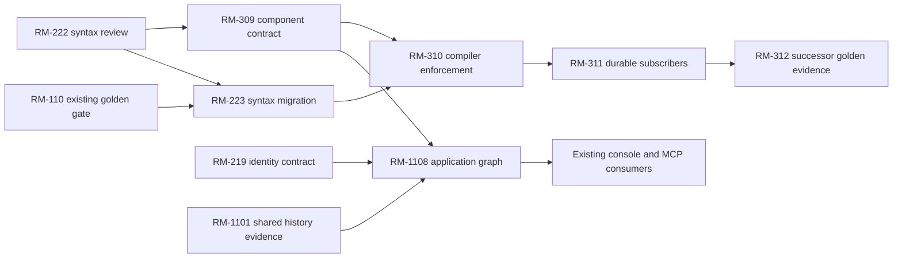

# Roadmap planning assessment

**2026-10-03 planning-only sweep entry:** Scope is the 82 currently open roadmap
tasks, with conditional tasks kept at decision/probe depth until activated.
Recommended batch pin: `gpt-6-sol/medium`, set by cross-epic language,
authentication, service and transaction dependency planning. The active chat's
model and effort were unavailable from current-chat metadata, so this sweep is
**model deferred** before substantive planning. The owner replied “go” to the
switch-or-override question, which is treated as a scoped override for this
planning-only sweep. Actual model/effort remain unknown; do not record the
recommendation as actual settings. This checkpoint changes no task's planning
or execution state.

Initially assessed 2026-10-01 against working tree `1da4f900b0e489796acf2c72651c5681468ccf95`, including existing uncommitted changes. That pass covered 89 then-open tasks. Planning states in the tables below were refreshed by the 2026-10-03 sweep for the current 82-task open snapshot; the original findings and counts remain dated evidence. The [roadmap](../implementation-roadmap.md) continues to own scope, estimates, execution state and next-stage model routing; detailed contracts retain their existing owners.

Three authorised planning agents assessed separate epic groups; the coordinator reconciled evidence and dependencies. Actual settings were `gpt-6-astra` High, verified from current turn metadata, suitable for the coupled language/security review. This pass inspected source and existing evidence; it did not execute product tests, implement features, activate conditional work, contact participants or reopen campaigns.

## Result and execution window

At the 2026-10-01 assessment, all 89 then-open tasks were assessed: **54 planned, 35 needs planning, zero unassessed, zero needs input for that assessment**. The previous snapshot had 26 planned, 19 needs planning and 44 unassessed. The 2026-10-03 sweep below supplies the remaining next-stage plans: **82 currently open tasks planned, zero needing planning**. Adequate planning includes bounded decision, review and inventory procedures; it does not mean implementation can start. All 22 conditional tasks retain their activation gates. No speed multiplier can be inferred from a planning run.

For the next authorised implementation window, use three worker roles with one coordinator:

1. **Golden application delivery:** audit RM-103's existing evidence, then implement the checked exchange transport (RM-104) and prove synchronous routes (RM-107). RM-204 typed inputs unlock list work. Use one compiler writer; evidence and fixture preparation can run alongside it.
2. **Independent coverage work:** RM-201's grammar/name matrix and RM-508's diagnostic trigger inventory share coverage facts but can be assembled without editing compiler files. RM-210 host qualification is another largely independent queue. Land parser changes separately from route grammar work.
3. **Contract and adversarial review:** reconcile RM-301/RM-401/RM-207 service, retry and uncertain-outcome boundaries, with RM-205 lifecycle review next. Independent review of the actual implementation can replace a worker slot as needed. Reviewers must not certify changes they authored.

The runtime has four active-agent slots including the coordinator. More queued task plans would not remove shared compiler-file ownership, review capacity, host access or contract dependencies. Isolate implementation ownership/workspaces and integrate each coherent change before assigning conflicting writers. RM-801 and RM-901 offer additional independent preparation after golden priorities, without opening new implementation tracks.

## Accepted directions

The owner selected both directions on 2026-10-01. They are recorded in the [decision register](../decision-register.md), [naming contract](../naming-and-qualification.md#9-reserved-word-policy-direction--2026-10-01) and [formatter rules](../formatter-rules.md):

- **RM-201:** reserve control/declaration words; explicitly permit contextual names only where declaration and use are both supported. The exact per-production allowlist still needs the matrix and public-language review. Preserve frozen naming section 2 and its historical digest.
- **RM-202/RM-203:** derive canonical layout from syntax while preserving comments, string contents and parsed meaning. Equivalent parsed code should converge despite incidental authored line breaks. Existing line-sensitive constructs mean blindly stripping newlines is not a valid oracle. The decision is recorded; formatter implementation remains open.

Neither decision alone closes a roadmap task in this planning assessment.

## Shared contract gates and sequencing

1. **Retry clock:** approved TIME-D05 gives each retry attempt a new stable `clock.now` snapshot. The [transaction plan](../transaction-retry-plan.md) and lifecycle candidate now follow it; nested calls share only their current attempt's snapshot. Monotonic elapsed budgets still advance. This supersedes the earlier fixed-clock candidate without amending TIME-D05.
2. **Transaction freeze and evidence:** RM-401's [bounded adapter probe](../../tests/validation/rm401-phase-probe-results.json) now records pinned SQLite busy/rollback, PostgreSQL 40001/40P01 abort and a committed write with lost acknowledgement. It does not add automatic replay. Required independent transaction review then permits RM-402 production retries and the full contention/crash/cancellation matrix. Moving all evidence to RM-402 would create a circular gate.
3. **Uncertainty contract milestone:** RM-207 first produces reviewed shared outcome vocabulary, adapter evidence obligations and Bun-only HTTP mapping. This named **boundary-contract milestone** can unlock RM-303 and RM-402 after their other prerequisites. RM-207 itself stays open until actual provider/transaction/job integration traces, recovery and artifact agreement are evidenced. A synthetic unknown read fault proves an envelope only. This staging removes a whole-task circular wait without waiving review or integrated evidence.
4. **One uncertainty model:** services, transactions and jobs share effect certainty and no-unsafe-resend rules. Database rejection proof and remote dispatch proof remain different; avoid independent retry systems and multiplied nested budgets.
5. **Reminder rescheduling:** Todo.id is the frozen deduplication key, while PATCH-005 resets reminder_sent_at when due_at is supplied. SERVICE-001 rejects changed payload under one key. The [service plan](../service-plan.md#reminder-identity-reconciliation) requires an initial-send/date-change/later-job/provider trace and reviewed disposition before reminder integration. Do not invent a generation key or silently revise the frozen source.
6. **Golden readiness:** RM-109 full closure requires RM-403's CONFIG-003 evidence. Harness scaffolding can start earlier, but readiness is not optional. The roadmap now makes this existing acceptance dependency explicit.
7. **Assurance chronology:** exploratory implementation deferral does not retroactively freeze P10R instruments or erase prior exposure. Reuse existing E07/E08 studies, retain original and revised digests, version changes and independent adjudication.
8. **Campaign and conditional limits:** the capability monitor reached its stop condition; RM-902 needs explicit reopening, not an old resume note. Large-row parity and the monitor's 2× gate are separate. E11 first needs one shared history/identity/disclosure/access contract before UI and MCP adapter work; all activation gates remain intact.

## Per-task assessment

The finding records what was inspected and why a proportional plan is or is not sufficient. Source links point to existing evidence, not fresh verification. Next stage and preferred model are in the roadmap. The owner's subsequent frugal-routing instruction supersedes capability-only alternatives in this assessment and its linked plans: select the lowest sufficient model/effort, and pause for a switch on a mismatch in either direction. Astra High being capable is not permission to continue when a smaller model suffices. Recheck source, stage recommendations, actual settings and execution gates on selection.

| Task ID | Planning state | Depth | Finding and evidence |
|---|---|---|---|
| RM-1001 | planned | conditional research protocol | Existing brief is unusually complete: real task per site, dated capture, wrong turns, time to success and evidence limitations. Can reuse on activation; no web research needed now. Evidence: [implementation-history.md](../implementation-history.md); [implementation-roadmap.md](../implementation-roadmap.md). |
| RM-1002 | planned | conditional synthesis | Output structure and evidence standard are sufficient; decisions should follow actual teardowns, not premature preference. Evidence: [implementation-history.md](../implementation-history.md). |
| RM-1003 | planned | conditional IA/content contract | Nine page types and semantic-authority boundaries are explicit, but audience journey priorities, search/versioning and content-generation ownership need decisions from evidence. Evidence: [implementation-history.md](../implementation-history.md); [README.md](../README.md). |
| RM-1004 | planned | conditional usability instrument | Named journeys exist but exact tasks, success criteria, representative sample, scoring and recruitment are absent; first-user adoption study is not a substitute. Evidence: [implementation-history.md](../implementation-history.md); [first-user-review-guide.md](../first-user-review-guide.md). |
| RM-1005 | planned | conditional launch evidence | No evidence of jadpo.dev ownership or approved hosting configuration; repository naming does not supply it. Optional .com must not become dependency. Evidence: [decision-register.md](../decision-register.md); [implementation-roadmap.md](../implementation-roadmap.md); [conversation-coverage.md](../conversation-coverage.md). |
| RM-103 | planned | direct closure audit | Origin revision and integrated browser evidence now exist; remaining task is exact-evidence closure audit, not another authentication implementation. Historical pending wording is stale. Evidence: [REVIEW.md](../../examples/golden-todo/REVIEW.md); [golden-protected-route.test.ts](../../tests/runtime/golden-protected-route.test.ts); [rm102-authentication-review.json](../../tests/validation/rm102-authentication-review.json); [implementation-history.md](../implementation-history.md). |
| RM-104 | planned | short plan with checked transport design | Trusted host lifecycle is covered; authored /auth/exchange remains absent. Raw keys must not become ordinary business values or new administration permissions. Evidence: [auth-runtime-extensions.md](../auth-runtime-extensions.md); [acceptance.json](../../examples/golden-todo/acceptance.json); [first_party_authentication.ts](../../jadpo/crates/core/src/runtime/first_party_authentication.ts); [golden-service-credentials.test.ts](../../tests/runtime/golden-service-credentials.test.ts). |
| RM-105 | planned | short staged | Existing plan preserves JSON cursor, keyset ordering and one application-query budget; live list route absent. Evidence: [route-input-v0.1.json](../../tests/assurance/route-input-v0.1.json); [app.jadpo](../../examples/golden-todo/app.jadpo); [target.rs](../../jadpo/crates/core/src/target.rs). |
| RM-106 | planned | short staged | Entity-owned lifecycle is selected; current manual deleted-row concealment is not general automatic lifecycle enforcement. Evidence: [lifecycle-plan.md](../lifecycle-plan.md); [todo.jadpo](../../examples/golden-todo-migration/entities/todo.jadpo); [user.jadpo](../../examples/golden-todo-migration/entities/user.jadpo). |
| RM-107 | planned | short integration | Get/create/patch source exists and create already executes; remaining scoped runtime matrix and UserWithTodos route/query need assessment. Evidence: [todos.jadpo](../../examples/golden-todo-migration/routes/todos.jadpo); [liveness.jadpo](../../examples/golden-todo-migration/routes/liveness.jadpo); [todo.jadpo](../../examples/golden-todo-migration/entities/todo.jadpo); [golden-protected-route.test.ts](../../tests/runtime/golden-protected-route.test.ts). |
| RM-108 | needs input | decision-dependent composition | Reminder role, 3 scheduled invocations / 1 hour and exact self-disable grants are owner-approved; repaired self-disable is independently reviewed and verified. New input: golden-only 60s execution / 40s renewable lease proposal. See the [owning plan](golden-delivery-planning.md#rm-301307108--services-durable-jobs-and-reminders). RM-307 and checked worker integration remain gates. Preserve pressure provenance and the reviewed persisted-intent successor. |
| RM-109 | planned | short verifier integration | All original44 IDs are mapped but executed evidence protocol/harness remains missing; old map source gaps must not be confused with executed failures. Evidence: [verify.py](../../tools/verify.py); [golden-obligations.json](../../tests/validation/golden-obligations.json); [manifest.json](../../tests/validation/manifest.json); [acceptance.json](../../examples/golden-todo/acceptance.json). |
| RM-110 | planned | short final audit | Plan distinguishes technical golden completion from protected hosted/external assurance. Evidence: [verify.py](../../tools/verify.py); [README.md](../../tests/validation/README.md); [acceptance.json](../../examples/golden-todo/acceptance.json). |
| RM-1101 | planned | conditional measurement/data contract | OperationalLogEvent already carries semanticOperationId/sourceRevision and redacted attributes; no longitudinal latency/error/volume store or retention/sampling contract was found. Avoid rebuilding RM-211. Evidence: [developer-console-mcp.md](developer-console-mcp.md); [target.rs](../../jadpo/crates/core/src/target.rs); [developer-tooling.md](../developer-tooling.md). |
| RM-1102 | planned | conditional product/authority design | UI journeys are named but delivery/local-remote access and permissions are undecided. Console must consume version-matched facts and RM-602 review, not invent semantics. Evidence: [developer-console-mcp.md](developer-console-mcp.md); [implementation-roadmap.md](../implementation-roadmap.md); [developer-tooling.md](../developer-tooling.md). |
| RM-1103 | planned | conditional scheduled-result contract | Job history must reuse RM-308 identities and distinguish missing/truncated/expired output; output disclosure and persistence retention unresolved. Evidence: [developer-console-mcp.md](developer-console-mcp.md); [decision-sprint.md](../decision-sprint.md). |
| RM-1104 | planned | conditional inspection security contract | No first-party runtime MCP transport/auth/scope/tool/output-limit contract exists. Shared evidence schema can be reused; connection must grant no implicit mutation authority. Evidence: [developer-console-mcp.md](developer-console-mcp.md); [developer-tooling.md](../developer-tooling.md). |
| RM-1105 | planned | conditional verification workflow | Representative workload, before/after comparability and successful improvement threshold are not selected. A performance repair campaign requires a confirmed bounded target. Evidence: [developer-console-mcp.md](developer-console-mcp.md); [roadmap-workflow.md](../roadmap-workflow.md). |
| RM-1106 | planned | conditional advisory pilot | Four broad advisory use cases remain alternatives, not one executable task. Deterministic offline compiler/policy/test authority is fixed; provider/privacy/data and false-positive baseline unknown. Evidence: [product-strategy.md](../product-strategy.md); [developer-console-mcp.md](developer-console-mcp.md). |
| RM-1107 | planned | conditional commercial research | Customer need, pricing, cost/terms and launch are unvalidated; no dependence on an advisory provider or permission to build hosted infrastructure. Evidence: [product-strategy.md](../product-strategy.md); [developer-console-mcp.md](developer-console-mcp.md). |
| RM-201 | planned | short plan | Owner selected reserved control/declaration words with explicitly safe contextual names. Existing 91-keyword evidence is lexical; declaration acceptance and usable references differ (return). Build production-by-name-class matrix, classify current behavior, then make selected policy executable. Exact contextual allowlist is not yet checked. Evidence: [naming-and-qualification.md](../naming-and-qualification.md); [grammar-v0.1.md](../grammar-v0.1.md); [parser.rs](../../jadpo/crates/syntax/src/parser.rs); [validation_syntax_boundaries.rs](../../jadpo/crates/syntax/tests/validation_syntax_boundaries.rs); [lib.rs](../../jadpo/crates/semantic/src/lib.rs). |
| RM-202 | planned | direct | Owner selected syntax-derived canonical layout independent of authored non-comment line breaks; preserve comment/string contents. Record direction without claiming current formatter meets it. Existing field optional attachment is line-sensitive and must preserve parsed AST. Evidence: [formatter-rules.md](../formatter-rules.md); [language-issues.md](../language-issues.md). |
| RM-203 | planned | short plan | Existing grammar matrix and snapshots supply regression baseline. Add AST-guided line reconstruction, comment attachment and parsed-AST equivalence before replacing snapshots. Preserve tokens/string bytes, idempotence, parseability and stable diagnostics; do not treat every removed physical break as semantics-preserving input. Evidence: [formatter-rules.md](../formatter-rules.md); [formatter.rs](../../jadpo/crates/core/src/formatter.rs); [uncovered-grammar-alternatives.jadpo.formatted](../../tests/formatter/cases/uncovered-grammar-alternatives.jadpo.formatted). |
| RM-204 | planned | short plan | Existing plan settles cursor representation and decoding distinctions. RouteDeclaration still has only path/body, OpenAPI only path parameters, so no hidden partial query implementation. Strengthen raw-percent validation and actual duplicate-header observability; Fetch Headers may merge originals. Evidence: [ast.rs](../../jadpo/crates/syntax/src/ast.rs); [parser.rs](../../jadpo/crates/syntax/src/parser.rs); [artifacts.rs](../../jadpo/crates/core/src/artifacts.rs); [target.rs](../../jadpo/crates/core/src/target.rs); [route-input-v0.1.json](../../tests/assurance/route-input-v0.1.json). |
| RM-205 | planned | decision / experiment | Entity-owned direction already chosen and candidate positive/negative pressure cases exist. Remaining stage is independent review/freeze of grammar, automatic visibility, protected-field ownership and concealed outcomes, not another architecture choice. Review User visibility propagation carefully so owner references do not invent a permission or cascade. Evidence: [lifecycle-plan.md](../lifecycle-plan.md); [lifecycle-v0.1.json](../../tests/assurance/lifecycle-v0.1.json); [policy-plan.md](../policy-plan.md). |
| RM-206 | planned | short plan | Conditional lowering plan adequately covers AST, ownership, graph, audit, visibility and same-transaction guards, nested bypass and both-database races. Do not duplicate entity policy or enforce owner activity implicitly. Evidence: [lifecycle-plan.md](../lifecycle-plan.md); [lifecycle-v0.1.json](../../tests/assurance/lifecycle-v0.1.json); [typecheck.rs](../../jadpo/crates/semantic/src/typecheck.rs); [target.rs](../../jadpo/crates/core/src/target.rs). |
| RM-207 | planned | decision / experiment | Plan distinguishes unknown commit from confirmed rollback; existing envelope test injects unknown on a read and cannot establish ambiguous writes. HTTP500 choice must stay Bun adapter-specific, not shared semantic status. Provider/job uncertainty must share durable identity with E03. Evidence: [failure-model.md](../failure-model.md); [transaction-retry-plan.md](../transaction-retry-plan.md); [validation-persistence.test.ts](../../tests/runtime/validation-persistence.test.ts); [target.rs](../../jadpo/crates/core/src/target.rs). |
| RM-208 | planned | decision / experiment | Confirmed mismatch: schema advertises JSON array/object while handlers require JS Set/Map. Need concrete alternatives for map key identity/encoding, duplicate key/value handling, order, null/omission, equality and roundtrip before choosing encoding. Do not solve by weakening schemas or silently coercing arbitrary objects. Evidence: [type-system.md](../type-system.md); [artifact-contract-findings.md](../../tests/validation/artifact-contract-findings.md); [validation-artifact-contracts.test.ts](../../tests/runtime/validation-artifact-contracts.test.ts). |
| RM-209 | planned | decision / experiment | Legacy type/persist is still compatibility evidence; current entity syntax is preferred. Need inventory public examples/tooling, identify any accepted semantic differences, then propose retained/deprecated/removed behavior and warning versus error compatibility policy. Frozen golden pressure source stays unchanged. Evidence: [entity-query-model.md](../entity-query-model.md); [language-issues.md](../language-issues.md); [108_unified_types_and_persistence.jadpo](../../tests/compile/pass/108_unified_types_and_persistence.jadpo); [implementation-history.md](../implementation-history.md). |
| RM-210 | planned | short plan | Six fixtures and four adapters are ready. Prism/Shiki engine smoke exists, Highlight.js/Monaco only registration tests. Execute all in actual renderer hosts with pinned versions, inspect visual categories and compare source text exactly including malformed source and unregistered fallback; save host screenshots/versions plus observations. Evidence: [README.md](../../editors/rendering/README.md); [jadpo-snippets.md](../../editors/rendering/fixtures/jadpo-snippets.md); [highlightjs.cjs](../../editors/rendering/highlightjs.cjs); [monaco.mjs](../../editors/rendering/monaco.mjs). |
| RM-211 | planned | short plan | Existing disclosure contract and canary tests support a bounded residual-coverage inventory. Trace event emission through browser/log/trace/exporter/agent packet; add only missing sinks using current safe-value boundary, compare revision-matched packet and stale revision rejection. Provider-side redaction cannot replace local filtering. Evidence: [developer-tooling.md](../developer-tooling.md); [diagnostic-presentation-contract.md](../diagnostic-presentation-contract.md); [secret-mutation-findings.md](../../tests/validation/secret-mutation-findings.md); [tooling-findings.md](../../tests/validation/tooling-findings.md). |
| RM-212 | planned | decision / experiment | Existing bounded relationship contracts give constraints but no selected extension or application counterexample. Activation must name compound identity/reference or traversal gap; one decision/probe per gap, include required inverse-one totality, per-hop order/bounds, join entities, policy filtering and fixed query budgets. Evidence: [entity-query-model.md](../entity-query-model.md); [language-issues.md](../language-issues.md); [persistence-v0.1.md](../persistence-v0.1.md). |
| RM-214 | planned | decision / experiment | Human intent/provenance must not be fabricated from compiler facts. Needs concrete annotation ownership, ID/reference schema, edit/rename/stale links and conflict behavior. Share provenance requirements with RM-601/RM-219 but do not block RM-601 on speculative source annotation grammar. Evidence: [language-issues.md](../language-issues.md); [semantic-model.md](../semantic-model.md); [approval-protocol.md](../approval-protocol.md). |
| RM-215 | planned | decision / experiment | Old TYPE-001/FAIL-001 issue prose conflicts with implemented construction, propagation and exhaustive outcome recovery. Start an implemented/provisional matrix from fixtures and source, preserve core, then prepare separate small decisions for context/cause disclosure, aliases, catalogue/422, localization and explicit panic. No wholesale outcome redesign needed. Evidence: [failure-model.md](../failure-model.md); [type-system.md](../type-system.md); [113_outcome_match_recovery_mapping_propagation.jadpo](../../tests/compile/pass/113_outcome_match_recovery_mapping_propagation.jadpo); [63_function_failure_propagation.jadpo](../../tests/compile/pass/63_function_failure_propagation.jadpo). |
| RM-216 | planned | decision / experiment | No chosen application gap across iteration/matching/lambdas/recursion/generics/aliases/escapes. A single omnibus implementation plan would invent language scope. Upon activation inventory support with positive/negative examples and cost/termination boundaries; preserve nominal aliases, immutable values and enum baseline. Evidence: [type-system.md](../type-system.md); [grammar-v0.1.md](../grammar-v0.1.md); [language-issues.md](../language-issues.md). |
| RM-217 | planned | decision / experiment | Current Fetch request/response boundary does not settle streaming/uploads or post-header failure. Need cancellation state diagram covering pre-effect, transaction commit/unknown and streamed response phases; never assume disconnect rolls back an accepted effect. Distinguish durable continuation from ordinary request cancellation. Evidence: [runtime-target-v0.1.md](../runtime-target-v0.1.md); [failure-model.md](../failure-model.md); [transaction-retry-plan.md](../transaction-retry-plan.md). |
| RM-218 | planned | decision / experiment | Some limits exist (credential header lengths, bounded queries) but no evidenced complete body/rate/collection/execution/cancellation inventory. Build per-boundary enforced/unsupported/adapter-owned table before proposing numeric defaults; distinguish semantic guarantee from process watchdog. Split missing implementation only after measured pressure. Evidence: [assurance-model.md](../assurance-model.md); [decision-register.md](../decision-register.md); [runtime-target-v0.1.md](../runtime-target-v0.1.md); [target.rs](../../jadpo/crates/core/src/target.rs). |
| RM-219 | planned | decision / experiment | Schema immutable registry IDs and runtime revision binding are different from general declaration rename stability. Inventory identities for operations/routes/callables, trace generated faults to source and compiler-owned helpers, compare rebuild/rename/stale-metadata cases. The [2026-10-04 identity plan](#rm-219--persistent-identity-and-exact-incident-evidence) adds divergent branches, insertion, copying/merges and graph-changing fixes while preserving immutable incident evidence. Do not call current graph ordinals rename-stable. Evidence: [migration-identity-v0.1.md](../migration-identity-v0.1.md); [developer-tooling.md](../developer-tooling.md); [artifacts.rs](../../jadpo/crates/core/src/artifacts.rs); [language_service.rs](../../jadpo/crates/core/src/language_service.rs); [tooling-findings.md](../../tests/validation/tooling-findings.md). |
| RM-220 | planned | decision / experiment | Recurrence/business calendars, alternate config/live reload and authored properties have independent semantics and no selected gap. Existing deterministic clocks, secret ownership and fixtures stay baseline. Separate activation/probe/estimate per extension; no new provider dependency follows from this assessment. Evidence: [time-testing-plan.md](../time-testing-plan.md); [configuration-plan.md](../configuration-plan.md); [language-issues.md](../language-issues.md). |
| RM-301 | planned | decision/review package | Candidate pinned provider contract exists; independent effect/security review and successor timeout/receipt disposition remain. Evidence: [service-plan.md](../service-plan.md); [service-contract-v0.1.json](../../tests/assurance/service-contract-v0.1.json); [service-reference-mail-v0.1.json](../../tests/assurance/service-reference-mail-v0.1.json). |
| RM-302 | planned | staged compiler subsystem | No accepted service AST/runtime feature found; existing fixture-first staged plan is adequate without inventing final grammar. Evidence: [service-plan.md](../service-plan.md); [ast.rs](../../jadpo/crates/syntax/src/ast.rs); [target.rs](../../jadpo/crates/core/src/target.rs). |
| RM-303 | planned | staged adapter subsystem | Local real HTTP adapter must prove dispatch certainty and typed receipt, not count in-process fake as conformance. Evidence: [service-plan.md](../service-plan.md); [service-contract-v0.1.json](../../tests/assurance/service-contract-v0.1.json); [failure-model.md](../failure-model.md). |
| RM-304 | planned | short staged | Existing callable-fixture core provides isolation; service fake shape/outcome boundary remains future extension. Evidence: [time-testing-plan.md](../time-testing-plan.md); [service-plan.md](../service-plan.md); [validation-fixtures-migrations.test.ts](../../tests/runtime/validation-fixtures-migrations.test.ts). |
| RM-305 | planned | decision/review package | Database-backed/coalesced scheduling direction is selected; canonical grammar, durable trace catalog, fencing and failure freeze remain work. Evidence: [time-testing-plan.md](../time-testing-plan.md); [entity-query-model.md](../entity-query-model.md); [golden-delivery-planning.md](golden-delivery-planning.md). |
| RM-306 | planned | staged subsystem | Private durable-state foundation is reviewed; nonexecuting typed job frontend is implemented with exact-decimal interval correction awaiting scoped re-review. Checked worker and event acceptance remain open. Current evidence/limits: [owning plan](golden-delivery-planning.md#rm-301307108--services-durable-jobs-and-reminders). |
| RM-307 | planned | staged subsystem | Detailed claim/crash/retry plan exists but no worker implementation; same-process locks cannot prove fencing. Evidence: [time-testing-plan.md](../time-testing-plan.md); [golden-delivery-planning.md](golden-delivery-planning.md). |
| RM-308 | planned | decision then short implementation | Safe inspect/retry/dead-letter requirements are present, but operator authentication/capabilities, retry legality and export/result retention contract are not yet specified. Evidence: [developer-console-mcp.md](developer-console-mcp.md); [golden-delivery-planning.md](golden-delivery-planning.md); [entity-query-model.md](../entity-query-model.md). |
| RM-401 | planned | decision plus bounded adapter probe | Candidate follows TIME-D05 and has saved SQLite/PostgreSQL abort/lost-ack evidence. Independent correction re-review approved freeze on 2026-10-02; RM-401 is complete, and RM-402 implements retries/full conformance. Evidence: [transaction-retry-plan.md](../transaction-retry-plan.md); [transaction-retry-v0.1.json](../../tests/assurance/transaction-retry-v0.1.json); [rm401-phase-probe-results.json](../../tests/validation/rm401-phase-probe-results.json); [target.rs](../../jadpo/crates/core/src/target.rs). |
| RM-402 | planned | short staged | Current wrappers/classification do not prove outcome phases; production retry must follow bounded adapter evidence, not optimistically retry begin rejection. Evidence: [transaction-retry-plan.md](../transaction-retry-plan.md); [entity-dossier.test.ts](../../tests/runtime/entity-dossier.test.ts); [entity-dossier-writer.ts](../../tests/runtime/fixtures/entity-dossier-writer.ts); [target.rs](../../jadpo/crates/core/src/target.rs). |
| RM-403 | planned | short staged | CONFIG-P5 supplies bounded required/advisory recovery/liveness semantics; existing default health route is not live dependency readiness. Evidence: [configuration-plan.md](../configuration-plan.md); [startup-failure.test.ts](../../tests/runtime/startup-failure.test.ts); [service-plan.md](../service-plan.md). |
| RM-404 | planned | platform decision plus adapter proof | Generic promotion/previous-revision semantics are stated but no selected platform hook/controller contract exists; external platform gate is separate from planning status. Evidence: [configuration-plan.md](../configuration-plan.md); [implementation-roadmap.md](../implementation-roadmap.md). |
| RM-405 | planned | bounded decision/probe | Authority/freshness protocol already specified; task can be planned as application-pressure decision while no physical store is activated. Evidence: [entity-query-model.md](../entity-query-model.md); [language-issues.md](../language-issues.md). |
| RM-406 | planned | adapter-dependent subsystem | Generic ordering/idempotency/watermark requirements do not settle selected adapter write/ack/conditional-update and failure semantics. Evidence: [entity-query-model.md](../entity-query-model.md); [target.rs](../../jadpo/crates/core/src/target.rs). |
| RM-407 | planned | adapter-dependent recovery plan | Recovery/rebuild intent is explicit but selected adapter switch atomicity, durable generation identity and rollback/catch-up proof remain unspecified. Evidence: [entity-query-model.md](../entity-query-model.md); [implementation-roadmap.md](../implementation-roadmap.md). |
| RM-408 | planned | bounded decision/probe | Existing exact-change-set/non-executable core is substantial; task is demand-selected extension, not permission to implement a universal migration engine. Evidence: [migration-identity-v0.1.md](../migration-identity-v0.1.md); [language-issues.md](../language-issues.md); [validation-fixtures-migrations.test.ts](../../tests/runtime/validation-fixtures-migrations.test.ts). |
| RM-409 | planned | bounded adapter evidence/decision | Compiler maps known uniqueness IDs; FK/check/exclusion need portable proof. SQLite current text matching for known uniqueness must not be generalized to ambiguous FK errors. Evidence: [language-issues.md](../language-issues.md); [persistence-v0.1.md](../persistence-v0.1.md); [migration-identity-v0.1.md](../migration-identity-v0.1.md); [target.rs](../../jadpo/crates/core/src/target.rs). |
| RM-410 | planned | bounded workload decision/probe | Static accepted index advice exists; richer planning must start with representative workload and measured adapter evidence, not all-query index recommendations. Evidence: [entity-query-model.md](../entity-query-model.md); [language-issues.md](../language-issues.md); [persistence-v0.1.md](../persistence-v0.1.md). |
| RM-503 | planned | decision / experiment | Five killed mutants are targeted evidence, not broad score. Next campaign should select accepted obligations outside naming/Unicode, retain passing baseline, compiling mutant, actual assertion failure/survivor, restoration and raw hashes in isolated checkout. Do not mutate shared compiler under other writers. Evidence: [rm503-mutation-findings.md](../../tests/validation/rm503-mutation-findings.md); [roadmap-gap-inventory.md](../../tests/validation/roadmap-gap-inventory.md). |
| RM-504 | planned | short plan | RM-102 now complete with real HTTP/JWT and eight PostgreSQL modes, so old plan blocker is stale. Reuse actual mode results and avoid duplicating auth work; remaining retry/policy/query/time and exact timezone/JWT provenance require an obligation matrix, current pinned runtime data and live PG execution. Evidence: [postgres.sh](../../tests/runtime/postgres.sh); [jwt-integration-findings.md](../../tests/validation/jwt-integration-findings.md); [golden-service-credentials.test.ts](../../tests/runtime/golden-service-credentials.test.ts); [time-testing-plan.md](../time-testing-plan.md). |
| RM-505 | planned | short plan | Plan adequately names cross-owner, lifecycle, revocation, duplicate/crash/unknown-write obligations and response/storage/effect/audit observations. Use RM-102 hostile credential results as existing evidence; cross-feature service/job/transaction cases await implementations. Evidence: [roadmap-gap-inventory.md](../../tests/validation/roadmap-gap-inventory.md); [lifecycle-v0.1.json](../../tests/assurance/lifecycle-v0.1.json); [golden-service-credentials.test.ts](../../tests/runtime/golden-service-credentials.test.ts). |
| RM-506 | planned | short plan | Existing registration/fail-closed manifest pipeline supports direct integration. Reconcile every suite/example disposition, run full gate and require-golden where claimed, archive exact revision/tool versions and named external gates. An updated manifest is not executed evidence. Evidence: [README.md](../../tests/validation/README.md); [manifest.json](../../tests/validation/manifest.json); [test_verifier.py](../../tests/validation/test_verifier.py); [verify.py](../../tools/verify.py). |
| RM-507 | planned | short plan | Need actual hosted run, protected required-check configuration evidence and bypass/failed-check exercise. Preserve local/hosted distinction and do not claim repository workflow YAML enforces protection. Choose provider only with actual X-CI authority; collect settings/report proof without exposing credentials. Evidence: [README.md](../../tests/validation/README.md); [verify.py](../../tools/verify.py); [approval-protocol.md](../approval-protocol.md). |
| RM-508 | planned | decision / experiment | 480 is a historical inventory, not safe current constant. Re-enumerate public emitter branches and grammar obligations, classify actual trigger+assertion vs reference-only and operational emitters, map projections separately. Reuse evidenced ROUTE/FAIL/SEM trigger work; new credential codes also need coverage. Inventory first, then size missing-case batches; exhaustive claim waits on all entries. Evidence: [README.md](../../tests/diagnostics/README.md); [build.rs](../../jadpo/crates/diagnostics/build.rs); [validation_catalogue_discovery.rs](../../jadpo/crates/diagnostics/tests/validation_catalogue_discovery.rs); [diagnostic-discovery-findings.md](../../tests/validation/diagnostic-discovery-findings.md); [grammar-v0.1.md](../grammar-v0.1.md). |
| RM-601 | planned | decision / experiment | Source confirms partial scaffold: null before digests, decisions/effects mostly empty, fnv1a64 correlation only, headed text differs from JSON. Strengthen extraction/provenance/canonical-byte design before implementation. Need transitive effects and same-topology behavior delta, cryptographic subject binding and actual AP-11 omission tests. Evidence: [approval-protocol.md](../approval-protocol.md); [artifacts.rs](../../jadpo/crates/core/src/artifacts.rs); [approval-protocol-v0.1.json](../../tests/assurance/approval-protocol-v0.1.json). |
| RM-602 | planned | decision / experiment | Brief is rich but implementation layout/state/accessibility and exact RM-601 artifact consumption not specified. Prototype permission/disclosure scenario with focused actor-route-query-field-output, successive revisions and newly reachable unchanged nodes. No dependency on Revset software. Freeze behavior contract and non-graphical equivalence before broad UI work. Evidence: [implementation-roadmap.md](../implementation-roadmap.md); [approval-protocol.md](../approval-protocol.md); [comprehension-study.md](../comprehension-study.md). |
| RM-603 | planned | short plan | Plan adequate for local fail-closed verifier using explicitly test-only issuer, exact cryptographic subject/policy/graph/version binding, each decision, reviewer separation/authority/expiry/revocation/replay. Correlation-only FNV cannot be approval trust input. Production issuance belongs protected RM-604. Evidence: [approval-protocol.md](../approval-protocol.md); [approval-protocol-v0.1.json](../../tests/assurance/approval-protocol-v0.1.json). |
| RM-604 | planned | decision / experiment | Provider choice/setup remains external, but qualification plan is concrete: clean rebuild exact subject, protected issuer/reviewer role, protected required verifier, forge/replay/repo/env bypass and provider-unavailable tests. Ordinary repository control must not manufacture release success. Evidence: [approval-protocol.md](../approval-protocol.md); [approval-protocol-v0.1.json](../../tests/assurance/approval-protocol-v0.1.json). |
| RM-605 | planned | short plan | Candidate already defines three surfaces, counterbalanced allocation, no same-change repeated exposure, answer/confidence/time capture and critical-risk scoring. Prepare exact-digest comparable task bundles including unchanged-topology deltas; freeze before responses, separate implementer/evaluator and instrument-version revisions. Evidence: [comprehension-study.md](../comprehension-study.md); [comprehension-v0.1.json](../../tests/assurance/comprehension-v0.1.json); [approval-protocol.md](../approval-protocol.md). |
| RM-701 | planned | bounded reconciliation | Candidate evidence map still contains PLAN-* links and older policy-proof authority; current implementation cannot be substituted into the frozen package without retained original/revised digests. Evidence: [implementation-history.md](../implementation-history.md); [verify-p10r.py](../../tools/verify-p10r.py); [evidence-map-v0.1.json](../../tests/assurance/evidence-map-v0.1.json); [README.md](../README.md). |
| RM-702 | planned | external review preparation | The external independent contract review remains real; agent self-review cannot supply its authority. Current roadmap schedules it after order/payment exploration, so exposure must be declared. Evidence: [implementation-history.md](../implementation-history.md); [approval-protocol.md](../approval-protocol.md); [research-brief.md](../research-brief.md); [verify-p10r.py](../../tools/verify-p10r.py). |
| RM-703 | planned | reuse complete study instrument | Screening, at least five qualifying participants, neutral 50–60 minute script, bias controls and synthesis decision already exist; no wholesale rewrite needed. Evidence: [first-user-review-guide.md](../first-user-review-guide.md); [first-user-review-record.template.json](../../research/first-user-review-record.template.json); [research-brief.md](../research-brief.md). |
| RM-704 | planned | reuse instrument with bounded repair-task addendum | Three counterbalanced review surfaces and false-confidence scoring are specified. Add exact revision-matched repair checkpoints to the existing instrument before execution; present prototypes are not external evidence. Evidence: [comprehension-study.md](../comprehension-study.md); [comprehension-v0.1.json](../../tests/assurance/comprehension-v0.1.json); [developer-tooling.md](../developer-tooling.md); [comparison-protocol.md](../comparison-protocol.md). |
| RM-705 | planned | bounded protocol freeze | Protocol already defines equal context, three clean runs per stack, counterbalancing, frozen/improved series separation and thresholds. Next work is incorporating accepted review findings and pinning versions. Evidence: [comparison-protocol.md](../comparison-protocol.md); [comparison-report-template.md](../comparison-report-template.md); [comparison-run-record.template.json](../../research/comparison-run-record.template.json); [typescript-baseline.md](../../examples/golden-todo/typescript-baseline.md). |
| RM-706 | planned | assurance exit matrix | Original D1/hosted exit cannot be replaced by local SQLite/Postgres success. Need an explicit claim-to-platform disposition and full exit matrix before closure. Evidence: [implementation-history.md](../implementation-history.md); [implementation-roadmap.md](../implementation-roadmap.md); [approval-protocol.md](../approval-protocol.md); [validation-plan.md](../validation-plan.md). |
| RM-801 | planned | decision dossier; strengthened bounded preparation | Money is a substantive gap: current Decimal lowers to finite JavaScript number and SQLite REAL/Postgres NUMERIC; this is not evidence of exact cross-target monetary arithmetic. No order-payment dossier exists yet. Evidence: [decision-sprint.md](../decision-sprint.md); [implementation-history.md](../implementation-history.md); [decision-register.md](../decision-register.md); [target.rs](../../jadpo/crates/core/src/target.rs). |
| RM-802 | planned | novel durable workflow contract | Compiler deliberately rejects durable_workflow target generation. Existing candidate state names do not settle persistence layout, step/version upgrades, deduplication and reconciliation ownership. Evidence: [decision-sprint.md](../decision-sprint.md); [language-issues.md](../language-issues.md); [entity-query-model.md](../entity-query-model.md); [target.rs](../../jadpo/crates/core/src/target.rs). |
| RM-803 | planned | cross-component implementation decomposition | No accepted execution/state schema; cannot safely turn checkpoint-before/after into a code plan yet. Existing fail-closed target test must remain until conformance is implemented. Evidence: [decision-sprint.md](../decision-sprint.md); [language-issues.md](../language-issues.md); [target.rs](../../jadpo/crates/core/src/target.rs). |
| RM-804 | planned | state-machine recovery | Cancellation is a durable transition and compensation may fail; accepted transition legality and operator authority are missing. Evidence: [decision-sprint.md](../decision-sprint.md); [entity-query-model.md](../entity-query-model.md); [language-issues.md](../language-issues.md). |
| RM-805 | planned | reference-app decomposition | Concrete order/payment contracts and suite are absent; full implementation plan now would invent product decisions. Toolchain repair must be logged separately from application work. Evidence: [implementation-history.md](../implementation-history.md); [comparison-protocol.md](../comparison-protocol.md); [decision-sprint.md](../decision-sprint.md). |
| RM-806 | planned | credible baseline design | Facilities are concrete, but order/payment domain, exact package pins, policy library choice and durable provider workflow adapter are not frozen. Baseline must be idiomatic, not a mirror of Jadpo source. Evidence: [typescript-baseline.md](../../examples/golden-todo/typescript-baseline.md); [comparison-protocol.md](../comparison-protocol.md); [implementation-history.md](../implementation-history.md). |
| RM-807 | planned | reuse pressure-test protocol | Accepted role directories and static scaffold must remain; broad modules, companion files and capability packs are hypotheses. Existing scenarios include tiny, multi-domain, multi-app and incremental scaffold equivalence. Evidence: [project-structure.md](../project-structure.md); [implementation-history.md](../implementation-history.md). |
| RM-808 | planned | reuse frozen trial protocol | At least three counterbalanced clean trials, pinned tools/context and independent scoring are already designed. Need concrete checkpoint/run assignment after freeze, not new protocol now. Evidence: [comparison-protocol.md](../comparison-protocol.md); [comparison-run-record.template.json](../../research/comparison-run-record.template.json); [comparison-report-template.md](../comparison-report-template.md); [implementation-history.md](../implementation-history.md). |
| RM-809 | planned | reuse independent adjudication rubric | All seven thresholds, critical safety veto and dispute handling exist. Independent external adjudication cannot be replaced by more planning agents. Evidence: [comparison-protocol.md](../comparison-protocol.md); [comparison-report-template.md](../comparison-report-template.md); [implementation-history.md](../implementation-history.md). |
| RM-901 | planned | bounded inventory; strengthened next plan | Repository has source/runtime families and experiment evidence, but no complete compiler-backend coverage inventory. Fresh fixed-principal fixture runs do not establish generated authentication coverage. Evidence: [wasm-large-row-plan.md](../wasm-large-row-plan.md); [wasm-host-capabilities.md](../wasm-host-capabilities.md); [capability-monitor-results.md](../capability-monitor-results.md); [performance-ledger.md](../../experiments/capability-monitor/performance-ledger.md); [target.rs](../../jadpo/crates/core/src/target.rs). |
| RM-902 | planned | controlled campaign design | Earlier monitor stop was reached after 1.8% local cache gain failed 2x gate. Old resume paragraph predates final stop; it is not renewed authorisation. LR parity and monitor 2x gates are different experiments. Evidence: [wasm-large-row-plan.md](../wasm-large-row-plan.md); [performance-ledger.md](../../experiments/capability-monitor/performance-ledger.md); [capability-monitor-results.md](../capability-monitor-results.md). |
| RM-903 | planned | measurement plan after scope freeze | Bun-hosted attribution is not native/workerd throughput. Need selected artifacts/host/workload cells and independent load headroom before measurement can be meaningful. Evidence: [performance-ledger.md](../../experiments/capability-monitor/performance-ledger.md); [capability-monitor-results.md](../capability-monitor-results.md); [wasm-large-row-plan.md](../wasm-large-row-plan.md). |
| RM-904 | planned | durability experiment design | Existing local WAL/FULL gain does not cover sustained checkpoints or crash recovery. Duration, fault schedule, acknowledged-write invariants and matched disks remain to specify. Evidence: [wasm-large-row-plan.md](../wasm-large-row-plan.md); [wasm-typed-values-results.md](../wasm-typed-values-results.md); [performance-ledger.md](../../experiments/capability-monitor/performance-ledger.md). |
| RM-905 | planned | conditional hosted probe selection | Useful probe inventory exists, but exact account, selected product/storage authority, compatibility flags, cost budget and cleanup evidence are unselected. Local workerd cannot prove hosted coldness. Evidence: [wasm-host-capabilities.md](../wasm-host-capabilities.md); [wasm-large-row-plan.md](../wasm-large-row-plan.md). |
| RM-906 | planned | one generated vertical slice | Selected slice is unknown until inventory/host evidence. Fixture-local generation is not normal compiler-artifact support; source mutation, renamed fields and host enforcement must agree. Evidence: [wasm-large-row-plan.md](../wasm-large-row-plan.md); [capability-monitor-results.md](../capability-monitor-results.md); [generate-manifest.py](../../experiments/capability-monitor/generate-manifest.py). |

## Strengthened near-term plan: RM-201 naming and keyword conformance

Source findings: parser.rs:4234 expect_name permits only Identifier; :4242 expect_contextual_name delegates to :4250 expect_name_token, which accepts any ASCII-shaped token text. The latter is broader than usable named expressions. Semantic naming/case regressions are at jadpo/crates/semantic/src/lib.rs:3448/3463; tests/syntax boundary suite already covers lexical keyword boundaries. These are separate lexical, parser and semantic contracts.

Accepted direction: reserve control-flow/declaration words, explicitly enumerate only contextual words safe in both declaration and reference positions. Preserve exact case-sensitive lookup and existing UpperCamelCase/lower_snake_case semantic shapes. Current generic expect_name_token acceptance must not become the normative allowlist.

Sequence:

1. Derive every identifier-bearing grammar production from docs/grammar-v0.1.md and map its parser helper, declaration category and reference production. Include modules/imports, nominal types, values, fields, parameters, variants, functions/actions/queries, entity operations, configuration/authentication and future candidate job positions separately. An unimplemented job production is a pending contract entry, not an executed language feature.
2. Inventory current lexer tokens and classify keyword families under the chosen policy. Record each explicitly contextual allowance with a valid declaration AND reachable read/use example. Add paired declaration/reference tests so the existing `return` one-way binding cannot pass. If a word lacks a safe use path, keep it reserved rather than inventing an escape syntax.
3. Table-drive lexical boundaries (ASCII letters/digits/underscore; leading digits; Unicode; suffix/prefix token boundaries), semantic naming shapes (including valid digits, exact case, leading/repeated/trailing underscore rejection) and declaration/use positions. Add whole-program compile fixtures and representative real CLI/LSP error-span checks. No blanket lowercase/type-name test substitutes for individual productions.
4. Update owning naming contract and language issue status with the explicit selected policy and tested coverage; retain frozen historical digest sections and note contract revision provenance. Add future grammar entries to an uncovered-coverage guard so new declarations cannot silently evade the matrix. Preserve failures until each behavior has an accepted expectation.

Acceptance review: every implemented identifier-bearing production has both allowed and disallowed shape coverage; every keyword has variable/type position disposition and contextual use proof where allowed; exact lookup and UTF-8/UTF-16 diagnostic ranges agree. Future unsupported grammar and intentionally rejected spellings remain explicit. Existing compiled programs using newly reserved words need clear source diagnostics rather than silent semantic changes; RM-209 owns broader deprecation, not this selected policy.

Verification:

```sh
cargo test --manifest-path jadpo/Cargo.toml -p jadpo-syntax --test validation_syntax_boundaries
cargo test --manifest-path jadpo/Cargo.toml -p jadpo-semantic type_name_resolution_is_case_sensitive
cargo test --manifest-path jadpo/Cargo.toml -p jadpo-semantic semantic_name_shapes_separate_types_from_runtime_names
cargo test --manifest-path jadpo/Cargo.toml -p jadpo-cli
cargo build --manifest-path jadpo/Cargo.toml -p jadpo-cli
ruby tests/compile/verify.rb
python3 tools/verify.py
```

Also run the newly added matrix test binary by its final registered name; do not report the focused old tests as full coverage. Independent public-language review required. Sol High/Astra High for matrix/policy reconciliation; Luna Extra High for explicit table implementation. A read-only matrix inventory can run beside RM-204; parser/semantic writers must serialize. No owner decision remains on the policy direction.

## RM-508 inventory stage and efficient parallel work

An inventory pass is ready despite remaining language choices. Start from current diagnostics/build.rs production emitter discovery, inspect real trigger assertion bodies and compile expectation arrays, and join executed suite reports to code/branch obligations. Label reference-only, trigger-tested, branch-tested, projection-tested and operational-emitter coverage separately. Include CLI/LSP/IDE projections, stale-edit tests and secret canaries. Sample the coverage checker with a known reference-only entry to prove it does not self-certify. Run existing `cargo test --manifest-path jadpo/Cargo.toml -p jadpo-diagnostics every_public_diagnostic_is_authored_and_has_conformance_evidence` only as catalogue-reference validation; the complete `python3 tools/verify.py` does not by itself prove branch exhaustion. Newly needed tests follow sized gap batches, with every unchosen contract explicit. This is a bounded assessment plan, not a claim that all diagnostic cases are implemented.

Useful independent queues:

- Read-only RM-201 grammar inventory and RM-508 trigger inventory can proceed concurrently with near-term route implementation; they should share one coverage matrix to avoid duplicate keyword/diagnostic work.
- RM-210 renderer host qualification touches editors/rendering and host evidence, largely independent of compiler feature delivery. Changing shared grammar vocabularies still needs coordination.
- RM-215 document/source reconciliation and RM-219 identity inventory are read-only parallel investigations; semantic implementation waits for results.
- RM-601 extraction design and AP-11 fixture expectations can be developed independently of route work, but both use artifacts.rs; land sequentially.
- RM-503 mutation work must use an isolated copy/worktree and a confirmed bounded campaign. Never edit the shared compiler under an implementation or verifier worker.
- RM-507/RM-604 share protected-host authority and should reuse provider configuration/attack evidence, not produce independent incompatible trust assumptions. Neither is activated by this planning pass.

## Strengthened next plan: RM-801 pressure dossier

**Scope:** bounded preparation of the existing order/payment dossier and shared acceptance contract, not an order/payment application or workflow implementation. Suitable now below golden-app priority. Preferred Astra High; Sol High can assemble bounded cases, but unresolved money/workflow semantics need consequential review.

**Owners to reuse:** `docs/decision-sprint.md` D5, historical P12 requirements, `docs/decision-register.md`, accepted service/async decisions and `examples/golden-todo/typescript-baseline.md`. The named missing dossier `docs/order-payment-pressure.md` is an appropriate durable home when RM-801 is executed; do not create separate documents per scenario.

1. Define a small shared order/inventory/payment/refund domain with explicit authorities, service/user roles and acceptance-case IDs. Record illustrative choices as candidate decisions rather than accepted policy. Every case names initial state, external/clock event, visible outcome, durable state, forbidden duplicate effects and evidence category.
2. Add exact money examples before selecting representation: repeated fractional prices, per-line versus total rounding, currency scale mismatch, maximum magnitude/overflow, signed refunds, invalid non-finite values, JSON/client/SQLite/PostgreSQL round trips. Record current finite-number lowering as an observed boundary, not proof that any proposed representation is safe. Produce at least one positive and negative expected case per monetary decision.
3. Add success, decline, duplicate webhook, out-of-order/late success, crash-before-effect, effect-success-before-checkpoint, retry, cancellation, refund failure and manual intervention traces. State which facts are known versus `outcome_unknown`; separate local atomicity from cross-authority compensation.
4. Pressure payload enums through source typing/exhaustiveness, generated client decoding/tagging, storage constraints, old/new wire compatibility and migration. Classify currently supported behavior, missing implementation and undecided semantics independently.
5. Build a parity matrix against the credible TypeScript facilities; both stacks receive identical business/effect cases and fake provider/clock controls. No selected library/provider must dictate weaker cases. Keep compiler change, application authoring and adaptation costs separate.
6. Produce a compact decision packet for money, payload evolution and WORKFLOW-001, linking unresolved SERVICE/ASYNC contracts. Do not implement missing language features to make the application pass. Split and estimate accepted gaps in their owning backlog only after the decision.

**Completion evidence:** dossier covers every listed P12 pressure family; shared case schema has positive/negative and failure/recovery traces; current support/gaps are traced to source or existing fixtures; every unresolved policy/semantics question has options and consequences; baseline parity and later freeze/versioning are explicit. This preparation can finish before service/workflow implementation, but an unaccepted contract never authorizes those stages.

## Strengthened next plan: RM-901 backend inventory

**Scope:** read-only inventory and ranking of existing evidence. No new benchmark, optimization, host deployment or default-target decision. Preferred Sol High; current Astra High is suitable.

**Owners to reuse:** `docs/wasm-large-row-plan.md` COV-1/COV-2, `docs/wasm-host-capabilities.md`, capability-monitor ledger, current compiler target source/tests and `tests/validation/manifest.json`. Put the durable inventory in the existing experiment evidence area and link it from COV-1 when executed; avoid duplicate state lists in prose.

1. Freeze inventory source revision and enumerate all COV-1 families from checked IR, current Bun generation, compiler/runtime tests and golden obligations: values/types, control/calls, failures, data/relations/migrations, transactions/savepoints, authentication/freshness, policy, config/secrets/time, HTTP/services, cancellation/budgets and build/debug/deploy.
2. Give every capability separate columns for Bun, generated Rust/shared-Wasm, direct-Wasm and host dependency. Use the existing statuses `verified`, `implemented but unverified`, `unsupported`, `language contract unresolved`. Attach source location, positive/negative evidence, report/artifact revision, and provenance category (normal compiler generation, fixture-local generation, handwritten host/guest, documentation-only).
3. Reconcile each experimental claim with actual source mutations and regeneration evidence. Identify missing negative/host boundaries explicitly. Fixed-principal fixtures do not establish real credential authentication. Compilation, module import and local workerd startup do not establish hosted capability.
4. Rank unsupported *vertical slices* by semantic prerequisites, implementation breadth, existing reusable evidence, host needs and golden relevance. Separate unresolved semantics for every target from missing alternative-backend lowering. Do not estimate total backend adoption from one fast fixture.
5. Recommend one COV-2 first slice and record required contract/host prerequisites, source rename/mutation checks, regenerated versioned metadata, hostile-guest checks and adoption disposition. Merely nominate the slice; RM-906 owns qualification after RM-903/RM-904.

**Completion evidence:** each enumerated family accounted for with explicit support/evidence status; links and revision identities checked; generated versus fixture-only claims independently spot-checked; ranked smallest next slice and unresolved host/semantic blockers recorded. Inventory does not claim controlled-host performance, hosted cold starts, full golden acceptance or target migration.

## Conditional decision outlines

These are adequate plans for bounded decision work, not activation or full adapter implementation:

- **RM-405:** after RM-801 supplies actual pressure, identify authoritative fact and required freshness; compare authority-only query against one named derived adapter. Inventory atomic change-record support, conditional/idempotent apply, per-entity ordering, watermark/recovery/rebuild capabilities. Recommend adopt/defer/reject with supported invariants; absent need records fail-closed deferral. No invented second authority or cross-store atomicity.
- **RM-408:** select one unsupported migration shape only after application pressure. Freeze before/after registry snapshots and exact change set; specify existing-data validation, typed transform/backfill, rollback/irreversible status, crash checkpoints and adapter limitation matrix. Preserve current non-executable/review-required artifact status and unsupported cases. Scope/estimate concrete implementation separately after the decision package.
- **RM-409:** standalone bounded adapter evidence decision is available now. Inventory compiler-owned uniqueness identities and existing FK checks. Define two simultaneously relevant FK/check constraints to test whether drivers identify the actual constraint unambiguously; inspect structured fields, not ambiguous text. Propose stable declaration-derived identities that survive rename. Where SQLite cannot prove exact cause, preserve generic contained constraint error rather than pretending a pre-check avoids races. Positive/negative contract fixtures plus independent data/adapter review precede new mapping code. Check/exclusion support is not assumed to exist merely because identities are being designed.
- **RM-410:** activation requires representative workload pressure. Freeze query shapes/data distributions/read-write mix and adapter versions, enumerate unsupported semantic needs independently of indexing, compare EXPLAIN/statistics and read/write costs against existing static advice. Report adopt/defer/reject, uncertainty, compound/partial index tradeoffs and separately scoped implementation. No automatic index acceptance or measurement campaign is authorized by this assessment.

Within E01/E03/E04, four tasks retain **needs planning**: RM-308 operator capability/recovery/export semantics; RM-404 platform-specific hook/controller contract; RM-406 selected derived adapter apply/ack/watermark protocol; RM-407 its rebuild/switch/reconciliation crash protocol. Their existing broad requirements are useful but not concrete implementation handoffs. Missing selected platform/store is an execution/activation gate; this assessment does not demand an owner decision now just to fill a table.

## Evidence and limits

Near-term golden refinements are saved in the [existing delivery plan](golden-delivery-planning.md#assessment-refinements--2026-10-01). Baseline counts, task IDs, forecasts, execution states, conditional gates, historical completion records and frozen naming section are checked during consolidation. Local links, planning-state consistency and the dependency graph are checked; no product gate was rerun for documentation-only work. Source inspection is representative, not a claim of exhaustive independent implementation audit.

Timing runs: coordinator `META-ROADMAP-ASSESSMENT-88c014b0c2c7`; E01/E03/E04 `META-ROADMAP-ASSESSMENT-0716218ae298`; E02/E05/E06 `META-ROADMAP-ASSESSMENT-e569952cd46a`; E07–E11 `META-ROADMAP-ASSESSMENT-05eea8406c9d`; cross-group dependency review `META-ROADMAP-ASSESSMENT-2b954b678f0a`; consolidation review `META-ROADMAP-ASSESSMENT-288e76f5b9b6`. The [local recorder](../task-timing/README.md) retains actual intervals and settings. These META runs measure planning overhead; they are not implementation calibration samples for 89 tasks.

Consolidation checks passed: all 89 IDs and original forecasts/execution states preserved, five completion records unchanged, 22 conditional tasks preserved, 54/35 planning states consistent across saved plans, dependency IDs resolved without cycles, affected local links/anchors resolved and frozen naming section 2 unchanged. Independent consolidation review found no acceptance-gate weakening; its link and routing corrections were applied. `git diff --check` passed.

## Post-assessment intake — 2026-10-02

This row records a new idea after the 2026-10-01 assessment; it does not alter
that assessment's historical 89-task counts.

| Task ID | Planning state | Depth | Finding and evidence |
|---|---|---|---|
| RM-221 | planned | decision / experiment | The generated Bun target currently calls `matchRoutePath` for each authored route, splitting the template and request path per candidate. The owner requested a measured comparison with regex and other fast routing structures, then adoption of the best safe choice. Define representative route tables, correctness/precedence oracle, speed metric and trade-off limits before selecting an algorithm or estimate. Evidence: [target.rs](../../jadpo/crates/core/src/target.rs); [roadmap task](../implementation-roadmap.md). |

## Planning-only sweep — 2026-10-03

This sweep uses the current 82-task open-roadmap snapshot. It does not change
execution states, activate conditional tasks, approve public semantics, run
experiments, or implement code. The owner gave a scoped model-routing override;
actual model and effort are unknown. The recommended pin remains
`gpt-6-sol/medium` for this planning-only batch. The 2026-10-01 table above is
historical; the entries below are the current plans for its previously unplanned
rows. Each is adequate for the **next decision, evidence or implementation
planning stage**, not necessarily for immediate implementation. Recheck source
and dependency status when selected. Existing task forecasts are retained;
unestimated scope remains unestimated until its named input exists.
Planning run: `META-PLANNING-SWEEP-b252f4ed2678` (7.44 active minutes;
actual model/effort unknown) in the [local timing record](../task-timing/runs/META-PLANNING-SWEEP-b252f4ed2678.jsonl).

### E02 language, tooling and HTTP boundaries

| Task ID | Plan and acceptance evidence | Gate or decision retained |
|---|---|---|
| RM-208 | Inventory Set/Map values in source, generated schema and both runtime adapters. Compare array-of-entries, object and explicit tagged encodings for key types, ordering, duplicates and round-trip identity. Freeze one wire table with positive, malformed and duplicate cases; then split schema/runtime changes and verify the same cases end to end. | Public wire choice and compatibility require review; no representation is selected here. |
| RM-209 | Inventory accepted `type`/`persist` and `entity` examples, parser diagnostics and migration tools. Classify each legacy shape as equivalent, warning-only or unsupported with a named replacement. Prepare paired compile/migration fixtures and a staged documentation/diagnostic change, preserving frozen examples as historical evidence. | Owner chooses the compatibility and removal policy after seeing breakage; RM-101 obligation map remains fixed. |
| RM-212 | On a named application counterexample, isolate compound identity, composite reference or traversal as separate decisions. Compare explicit join-entity modelling first, then write positive/negative fixtures for the smallest missing operation and test policy scope, per-hop bounds/order, inverse-one totality and query budget. Estimate any approved implementation separately. | Conditional; no extension without concrete pressure. Failure-context syntax belongs to RM-215. |
| RM-214 | Inventory human-authored intent, rule and decision text versus compiler-derived facts and audit output. Draft minimal stable IDs/links, edit/rename/staleness and disagreement cases, with source examples that retain rationale and rejected alternatives. Seek a reviewed contract or explicit deferral before grammar/tooling work. | Human intent cannot certify a proof; approval of annotation authority and spelling is open. |
| RM-216 | Activate one demonstrated gap at a time. Reproduce it in a small application, compare current enum/match/collection patterns, then prepare positive/negative source cases, resource bounds and interactions with purity, failures and generated targets. Decide adopt/defer/reject for that gap, and separately estimate implementation. | Conditional; the listed language ideas are independent candidates, not an omnibus feature approval. |
| RM-217 | On application need, draw cancellation/effect states before and after headers and external or database effects. Use bounded disconnect, upload and stream traces to classify what can still be reported and what must finish or reconcile. Specify adapter fixtures and disclosure rules before implementation. | Conditional; ordinary disconnect cancellation does not imply structured concurrency or durable workflow semantics. |
| RM-218 | Make an enforcement matrix for body/rate/collection sizes, deadlines, CPU or execution budgets and cancellation in Bun and any claimed target. For each boundary record configured default, enforcement point, deterministic rejection, audit/disclosure and an over-limit fixture. Split unsupported implementations into scoped tasks after the inventory. | Defaults and cross-target guarantees require explicit contract review; existing isolated limits do not prove coverage. |
| RM-220 | On explicit selection, choose exactly one recurrence/calendar, configuration-source/reload or authored-property-test need. Compare it with accepted TIME/CONFIG/TEST behaviour, create a realistic fixture and bounded failure cases, then decide adopt/defer/reject and estimate its implementation. | Conditional; no shared estimate or semantics can be assigned to all alternatives. |
| RM-221 | Freeze a representative route corpus: static and parameter paths, shared prefixes, several table sizes, method mixes and miss-heavy traffic. First make a generated-HTTP semantic oracle for precedence, decoding, malformed paths and authentication order. Benchmark current linear splitting against indexed, trie/radix and precompiled-regex candidates with warm and cold runs, fixed runtime/hardware, latency distribution, throughput, allocation, build and startup cost. Select only a semantically equivalent design with a meaningful repeatable gain on the chosen workload; otherwise retain baseline. | The workload, primary speed metric and acceptable startup/memory trade-off need selection before measurements. Record a baseline and first-slice effort before estimating the full task. No algorithm is presumed fastest. |

### E03–E04 jobs, deployment and derived stores

| Task ID | Plan and acceptance evidence | Gate or decision retained |
|---|---|---|
| RM-308 | After RM-307 freezes durable run states, map operator identity/capability to inspect, retry and dead-letter transitions. Prohibit retries from nonterminal or uncertain-effect states unless reconciled. Specify pagination, redaction, retention and bounded export; test replay/crash/duplicate requests and safe denial. | Operator authority, recovery legality and result disclosure need review before implementation. |
| RM-404 | After a platform and disposable environment are selected, map its readiness, promotion and rollback hooks to RM-403 health states. Prepare a failing-revision test that observes the previous revision remaining healthy, plus cleanup and rollback evidence. | X-PLATFORM is an external gate; no generic controller promise substitutes for platform evidence. |
| RM-406 | Use the adapter selected in RM-405 and RM-306 outbox identity to write an ordered apply/ack/watermark protocol. Specify idempotent conditional updates, duplicate/out-of-order and lag tests, and the authority-only fallback when freshness cannot be proved. | Conditional; selected store capabilities and approved freshness contract determine implementation. |
| RM-407 | Enumerate crashes around delivery, acknowledgement, rebuild, catch-up and switch. Define generation identity, retained old/new state, reconciliation comparisons and rollback/switch preconditions, then test duplicate and missing deliveries with bounded recovery. | Conditional on RM-406; do not claim cross-store atomicity or promote an unproven generation. |

### E06–E08 review, assurance and order/payment

| Task ID | Plan and acceptance evidence | Gate or decision retained |
|---|---|---|
| RM-602 | Bind the UI to RM-601's versioned before/after artifact, including changed behaviour with unchanged graph structure. Prototype actor-to-output traversal, transitive unchanged declarations, scenario/source/evidence drill-down and narrow approval choices. Check stale revision rejection, accessibility and an equivalent non-graphical export before broader UI build. | Review authority remains with the accepted approval protocol; a graph alone never approves a change. |
| RM-702 | Assemble a reviewed-version manifest for all seven P10R packages, frozen originals and changed digests, plus explicit contradiction questions. After RM-701 and reference applications, give a genuinely independent reviewer the exact versions and record findings, resolution and remaining dissent. | X-REVIEW and reviewer independence are external; planning cannot satisfy the review. |
| RM-706 | Make a row for every original Milestone C/P10R exit claim, its exact required artifact, current proof, reviewer and disposition. Include protected attestation, hosted/deployment conditions and selected-platform evidence. Run the final matrix only after RM-705/RM-604/RM-507; mark unmet critical claims blocked rather than inferring them from local SQLite/PostgreSQL results. | Owner must explicitly decide any claim/scope change; RM-404 applies if platform deployment is in scope. |
| RM-802 | Start with RM-801's order/payment failure cases and accepted SERVICE/ASYNC boundaries. Specify persisted states and legal transitions around checkpoint-before-effect, dispatch proof, uncertain outcome, checkpoint-after-outcome, version upgrades, deadlines, cancellation, compensation failure and bounded operator action. Review executable crash and duplicate traces before approving WORKFLOW-001. | Public workflow semantics and intervention authority remain a decision; no implementation until reviewed. |
| RM-803 | After RM-802 acceptance, split a first compiler-generated slice: one persisted local step, one idempotent fake external effect and versioned restart identity. Map parser/IR, durable store, worker and generated artifact responsibilities; prove crash before and after each checkpoint, duplicate activation and revision mismatch. Expand only after the first slice passes. | Depends on RM-303/RM-306 as well; accepted workflow contract sets exact schema. |
| RM-804 | Derive a transition/fault matrix from the approved workflow and RM-803 persistence: cancellation at each boundary, late success, failed compensation/refund, repeated operator action and restart. Implement recovery in bounded slices, retaining uncertain outcomes for reconciliation and auditing every permitted intervention. | Operator authority and effect certainty from RM-802 cannot be improvised during implementation. |
| RM-805 | After golden and workflow gates, map each shared order/payment case to Jadpo source, generated operation, external fake and expected audit. Implement a small order-to-payment vertical path first, then add failure/recovery cases; retain original failing cases and separate compiler repair effort from application adaptation. | RM-801 dossier and RM-804 are prerequisites; do not rewrite the shared suite to fit Jadpo. |
| RM-806 | After RM-801 fixes the shared domain and suite, choose and pin idiomatic TypeScript framework, schema, persistence, policy and test facilities. Build a parity matrix for behaviour, effects and operational assumptions, then implement the same cases with clean-run adaptation records. | A credible baseline is independent of Jadpo syntax and cannot inherit later Jadpo-specific case edits silently. |

### E09 alternative runtime evidence

| Task ID | Plan and acceptance evidence | Gate or decision retained |
|---|---|---|
| RM-902 | Use RM-901's coverage inventory to propose one bounded native/workerd campaign: fixed artifacts, paired baselines, Unicode corpus, host/load-generator headroom, conformance guards, measurement budget and stop rule. Identify separately the monitor's prior 2× stop and large-row parity gate. | Prior stop remains in force; require explicit reopening before running another optimization campaign. |
| RM-903 | After RM-902 and X-HOST, pre-register native and workerd runs, warm/cold schedule, SQL counts, latency tails, CPU/RSS/startup and guest/host/control-message attribution. Preserve failures, confidence limits and inconclusive criteria; compare only equivalent workloads and source revisions. | Controlled host evidence is required; Bun-hosted attribution is not native or hosted qualification. |
| RM-904 | Pair identical storage plans and hardware for sustained WAL/FULL writes. Freeze checkpoint duration/schedule, kill/restart points and an acknowledged-write recovery oracle; measure throughput, tail latency and durability separately from target overhead. | X-HOST; local short-run WAL gains are a hypothesis, not the result. |
| RM-905 | On hosted activation, identify the selected Workers/storage product, required capabilities, account limits, budget and disposable resources. Freeze cold-start and transaction/freshness/isolation probes with cleanup and cost capture; report documented support separately from observed hosted behaviour. | Conditional on X-HOST and X-PLATFORM; no account or spend is authorised by this plan. |
| RM-906 | Select one gap ranked by RM-901 after RM-903/RM-904. Map fixture-local behaviour to normal compiler-generated, versioned artifacts and host enforcement; test regenerated positive/negative source mutations, rename, completion and failure mapping. Record shared-Rust versus direct-Wasm and adopt/extend/defer/reject with explicit remaining gaps. | Do not count handwritten fixture behaviour as backend coverage; broader lowering gets a new estimate. |

### E10 conditional public documentation site

| Task ID | Plan and acceptance evidence | Gate or decision retained |
|---|---|---|
| RM-1003 | After benchmark synthesis, rank user and agent journeys; map each prescribed page type to canonical owner, provenance, version and update path. Prototype navigation/search and accessibility/agent retrieval; test a defined task against source traceability and stale-version cases. | Conditional on RM-1002 and site activation; patterns are selected from evidence, not benchmark popularity. |
| RM-1004 | Freeze representative tasks, sample and success/failure measures for the agreed journeys before testing. Retain observed paths, wrong turns and accessibility failures, revise the brief, then estimate production only from the approved revision. | Conditional and X-REVIEW; no participant recruitment or approval is implied. |
| RM-1005 | After X-SITE/X-PLATFORM and RM-1004, inventory actual jadpo.dev registrar, DNS, host and deployment ownership. Draft a reversible launch checklist with verification, fallback, access and cleanup; seek separate launch approval. | Conditional; domain ownership and deployment are unverified, and optional jadpo.com is irrelevant. |

### E11 conditional console, MCP and advisory research

The [E11 intake](developer-console-mcp.md) owns the feature boundary; these are
planning outlines until the owner activates the epic or a named task. Share one
versioned inspection contract rather than separate UI and MCP meanings.

| Task ID | Plan and acceptance evidence | Gate or decision retained |
|---|---|---|
| RM-1101 | From RM-211 events, specify operation/revision identity, bounded samples, history store, retention and safe drill-down queries. Seed a repeatable slowdown and compare windows with sample counts; set and measure collection overhead before approving a storage design. | Conditional; retention, sampling and overhead limits are design decisions. Check RM-219 identity. |
| RM-1102 | On the shared schema, prototype read-only slowdown, failed-operation and RM-602 change-review journeys. Bind every source/evidence link to the producing revision; test stale, missing and unauthorized views and keyboard/accessibility paths. | Conditional; local/remote delivery and access authority must be selected. |
| RM-1103 | Map RM-308 run, attempt, retry and cancellation identities into the same inspection schema. Specify upcoming/history views and explicit missing/truncated/expired output, safe pagination and retention. Prove restart correlation and disclosure with seeded failures. | Conditional; RM-308 owns operator authority and result limits. |
| RM-1104 | Design bounded read-only MCP tools over the shared inspection queries, with selected transport, principal scopes, pagination, disclosure and revision checks. Test a connected LLM investigating seeded performance and job incidents plus unauthorized and oversize requests. | Conditional; connection grants no mutation, replay, policy approval or deployment authority. |
| RM-1105 | Choose one seeded bottleneck and equivalent before/after workload. Freeze correctness guard, measurement method, improvement target, revision checkpoints and independent review of the proposed fix. Show the same evidence in console and MCP and record regressions or inconclusive results. | Conditional; a measured campaign needs a confirmed target before execution. |
| RM-1106 | On explicit selection, pick one advisory question and labelled evidence set. Compare a deterministic baseline with a replaceable provider on accuracy, uncertainty, false positives, privacy and cost, retaining a fail-closed no-advice path. Decide adopt/defer/reject for that question only. | Conditional; compiler, policy and mandatory tests stay deterministic/offline; advisory output never authorizes a change. |
| RM-1107 | On explicit selection, choose a customer and research question. Compare local monitoring, paid monitoring, optional proxy and later hosted build/deploy as separate offers; capture customer need, data retention/privacy, costs, terms and portability. Record proceed/defer/reject before any product backlog. | Conditional; no pricing, provider, commercial launch or hosted infrastructure is approved. |

**Verification mode for later execution:** RM-221 is a good bounded
`verify-loop` candidate because choosing an algorithm requires a trustworthy
performance oracle and repeated comparable trials. Recommend initial p95 route
dispatch latency on the frozen corpus, with semantic parity, throughput,
allocation and startup/build cost as guardrails; confirm the target and acceptable
trade-offs before the campaign. RM-902/903 should reuse their existing frozen 2×
gate only if the stopped campaign is explicitly reopened. RM-1105 needs a seeded
bottleneck and a confirmed improvement target after E11 activation. None of
these recommendations starts a campaign or changes the current planning state.

## Deferred frontend intake — 2026-10-03

Added after the dated 82-task planning sweep; that sweep did not assess this
new task. The owner placed the exploration at the roadmap's end. Capture is not
a saved execution plan or activation; prototype scope, prerequisites and effort
still need assessment.

| Task ID | Planning state | Depth | Finding and evidence |
|---|---|---|---|
| RM-1201 | needs planning | deferred exploration | Explore compiler-derived application contracts, independent clients and an optional SSR/hosting plugin through representative React code and a bounded proof. Keep generated TypeScript integration central; mobile bindings and a native Jadpo frontend remain alternatives. Proposed comparisons and assurance/exit constraints are in [E12 intake](../implementation-roadmap.md#e12--explore-application-contracts-and-frontend-integration). Select contract subset, proof scope, additional prerequisites, measurements and model/effort only when activated. |

## Syntax, component messaging and graph intake — 2026-10-04

The owner requested a language-wide syntax review before the new event/component
and graph work. The intake below is followed by assessed decision-depth plans;
neither is a grammar freeze or an execution authorisation. The dated planning
sweep above did not assess these additions. Current golden delivery, frozen
ASYNC-001 and existing authorised loops retain their scope.

**Owner constraints:** keep concepts and syntax simple, use safe compiler/runtime
defaults wherever possible, and minimise authored wiring and configuration. A
routine subscriber should need only its typed event handlers and business body;
generated identities, registration and execution machinery do not require manual
setup. Explicit declarations remain necessary for business meaning or safety
that cannot be derived. One canonical interaction model must be enforced by
compiler rules, not an instruction an LLM can ignore.

| Task ID | Planning state | Depth | Finding and evidence |
|---|---|---|---|
| RM-222 | planned | language-wide decision plan | Inventory, candidate examples, grammar/failure/tooling checks and migration exit conditions are saved below. Owner locked existing UpperCamelCase/lower_snake_case naming and unnamed principal successor; prefers existing `attempt` with typed `emit_event(...)`. Event/query grammar and migration checks remain open. |
| RM-309 | planned | component/event decision plan | Boundary, publication, payload, recovery and coordination recommendations, worked traces and review gates are saved below. RM-222 is required before adopting the contract; no ASYNC-001 or golden retrofit is authorised. |
| RM-1108 | planned | conditional graph contract/probe plan | Artifact/trace/metric separation, historical identity mapping and shared UI/MCP journeys are saved below and in the existing E11 plan. Planning is selected; implementation activation and prerequisites remain unmet. |

**Identity clarification for RM-219's existing decision probe:** add branch
divergence, unrelated-node insertion and repeated graph-changing fixes to its
rebuild/rename/stale-metadata cases. Retain one immutable incident/build view and
a separately labelled current-branch mapping. Registry identity, content hashes,
names and source spans have different roles; never treat a name/hash match as
proof that the current implementation reproduces the historical behaviour.

**RM-309 boundary acceptance to assess:** imports expose message/data contracts
and pure shared computation, not another component's effectful implementation.
Subscribers are runtime entry points, not directly callable actions. Local
actions may be imported across files within their owner; effect ownership and
admission must be checked transitively through helpers and wrappers. A capability
needed for an independent reaction (for example mail delivery owned by the
notification component) must not become available to an emitter merely because
code is imported, renamed or moved. Ordinary shared helpers cannot hide writes,
network calls or other undeclared effects; foreign integrations use reviewed
effect-aware adapters. Include negative examples for cross-component action
imports/calls, directly invoking a subscriber, wrapper-mediated bypass, moving
effectful code into the emitter's file and raw integration access. Check the
same-component case too: component visibility alone cannot enforce a declared
subscriber-only effect. The compiler can enforce explicit ownership/trigger
contracts, not infer that arbitrary business behaviour ought to be a subscriber;
contract changes must remain visible in the semantic/graph diff. These are
proposed acceptance requirements, not an amendment to implemented action rules.

**Logging constraints:** reuse [the four disclosure channels](../failure-model.md#8-disclosure-and-observability-channels):
public safe failure response, structured redacted telemetry, semantic failure
trace and restricted low-level operational/defect diagnostics. Ordinary exported
logs do not acquire raw stacks, secrets or customer values merely because graph
inspection needs richer context. Exact build manifests/source maps require
retention outside disposable `build/`; standard logging must remain useful when
that artifact is unavailable and state that exact enrichment is missing.

### Session context and planning entry — 2026-10-04

Source: this chat, **Assess event-driven architecture**, thread
`01a105c2-7987-7571-86c8-2a4804c75f53`. The owner now requests complete roadmap
capture and planning here, with questions surfaced while this context is fresh.
This authorises planning of RM-222/RM-309/RM-219/RM-1108, not implementation,
another Goal, delegation or messages to the delivery chat. Read-only inspection
of related delivery records is permitted. Preserve the other session's selected
29-task golden scope and frozen contracts; additions do not extend that scope.

**Planning batch:** syntax consistency, component/effect/subscriber semantics,
identity across revisions and graph/telemetry delivery planning. Recommended pin:
`gpt-6-astra/medium`, because the hardest expected work is novel public-language
and effect-authority design coupled to recovery semantics. Actual settings are
user-confirmed `gpt-6-astra/medium`: the owner replied "I have selected
gpt-6-astra, Medium". Pin these settings through this bounded planning batch.
Earlier context-capture timing retains unknown settings; the separate planning
run records the confirmed settings. Assessed next-stage plans can be marked
planned; this does not make the features implementation-ready or complete.

The requested outcome is ready for bounded design planning; the discussion does
not establish that all semantic issues are resolved. The following preserves
the session's requirements and proposals without freezing their grammar.

**Motivation and scope.** Events are useful inside a monolith: introducing an
independent reaction should not require an LLM to find every producer and insert
another call. The owner wants one enforced interaction model, not optional
pub/sub alongside freely callable side-effect modules. Components, rather than
files or deployment units, own behaviour. Private actions across files and shared
pure calculations remain useful. A hosted broker, microservice migration and
event sourcing are not prerequisites or approved additions. Database-backed
durability must tolerate the declared process/host failures; ephemeral host disk
alone cannot guarantee survival of permanent host loss.

**Enforcement and event production.** Non-callable subscriber declarations alone
are insufficient: an emitter could import the subscriber's effectful helper.
Imports must not confer effect authority. Track actual effects transitively,
including wrappers and helpers moved into the emitter's own file, and admit
effects only from their declared logical owner and permitted entry context.
Ordinary shared functions remain pure; foreign/runtime integrations must use
checked effect-aware adapters. This extends, rather than falsely claims to be
already implemented by, existing action/visibility checks. The owner must declare
ownership and mandatory transition facts; the compiler cannot infer missing
business requirements or whether arbitrary logic ought to be a subscriber.

Tie required publication to the entity transition itself. An action-level
`emits` contract alone leaves another mutation path as a bypass. Every accepted
path performing the declared transition must pass the same compiler-managed
mutation mechanism and commit its required event with the change; raw updates
cannot circumvent it. The compiler constructs event data from validated
transition/result data. Rollback commits neither; business rejection and no-op
do not masquerade as a new successful transition. Distinguish logical events
from delivery attempts so crash recovery does not invent new business facts.

**Contracts, registration and defaults.** Events have immutable typed payloads,
owner, stable identity/version and source documentation. Generate one consistent
catalogue and producer/subscriber registration from declarations, rather than a
second authored registry or startup wiring. Every producer is checked against
the schema and every subscriber against its consumed version. Multiple typed
event handlers are supported. A new subscriber needing unavailable data causes
a contract error or an explicitly authorised query, not automatic payload
inflation or private-data exposure. Distinguish event-time snapshots from current
data and make stale-state handling explicit. Runtime identities, attempts and
correlation metadata are compiler-owned, not forged payload fields.

Subscribers should normally contain only typed handlers and business behaviour.
Execution policy/key declarations are optional when derivable or supplied by
reviewed defaults. Stable delivery identity is automatic; business ordering is
not interchangeable with that identity. Ambiguous required ordering, external
retry safety, completion conditions and permissions cannot be guessed. Keep
configuration, grammar alternatives and concepts minimal. No manual ack, claim,
outbox SQL, retry sleep or instrumentation boilerplate belongs in normal source.

**Message and coordination distinctions.** The proposed contract distinguishes
one-owner commands/requested work, fan-out facts/events and read-only queries
with freshness/deadlines, all through one checked interaction mechanism. Exact
public spelling and whether these need separate declarations remain RM-222/
RM-309 decisions. Durable command admission is distinct from eventual success;
read-only requests need not leave durable work obligations. A subscriber can
emit further events and call local actions. Handling either of several events
does not mean waiting for all of them. Correlated joins require persisted
progress, required inputs, deadlines and duplicate/late-arrival rules.

Prefer one subscriber authoring model with stateful coordination capabilities;
"workflow" may describe the resulting coordinated graph, rather than introduce
a redundant competing DSL. This is a direction to assess against existing
WORKFLOW-001, not an unreviewed removal of that contract. Payment/inventory
examples still need business state, idempotent steps, versioned progress,
compensation, cancellation, reconciliation and intervention. Cancellation cannot
undo a dispatched external effect; compensation is not transaction rollback.
Declare which required outcomes complete a request, keeping optional reactions
out of its success condition. Preserve true local atomicity where justified;
never silently substitute asynchronous convergence for an atomic invariant.

**Recovery and delivery.** Persist the originating change and event intent
atomically, and maintain recoverable obligations for every enrolled subscriber.
One subscriber succeeding must not cause its effects to repeat when another
fails. The subscriber's database changes, processed-delivery evidence and new
event intents commit together where they share a transaction domain; separate
databases require receiving-side deduplication, not an invented shared commit.
Reuse ASYNC-001's at-least-once, immutable identity/version, leases/fencing,
database-time claim authority, finite budgets, backoff/jitter, cancellation and
uncertainty boundaries. Permanent rejection/invalid data are not endlessly
retried. Stable provider keys alone do not prove an uncertain effect safe to
resend. Avoid multiplied nested retry budgets and preserve privileged replay.

Settle per-subscriber/key ordering and failed-predecessor disposition, stale
events/current eligibility, bounded queues/fan-out/concurrency, cycle termination
and admission when durable capacity is exhausted. Adding/removing subscribers
needs an enrollment/version rule for already committed events. New subscribers
default to future events; historical backfill is explicit. Separate projection
rebuild from replay of unfinished side-effect deliveries. Retain deduplication
evidence for the supported retry/replay horizon; do not quietly purge it or
re-run mail/payment effects during view rebuilds.

**Graph and inspection.** Compose component, operation and coordinated subgraphs
into the application graph. Nodes and edges link to source, typed contracts,
documentation and rationale/provenance. Generate user flowcharts and bounded
structured LLM inspection from the same underlying graph. A static graph records
possible control/data dependencies; per-request traces record actual paths,
fan-out, joins and repeated attempts; aggregates record traffic, latency, errors
and queue depth. Keep graph topology distinct from business correctness.

Dev mode overlays queued/running/retry/completed/failed/uncertain work, including
background work after the HTTP response, with logs, errors, timings and stats.
Separate queue wait, execution, database/external wait and coordinated waiting.
Filters expose component/operation/request/event/subscriber paths without hiding
cross-subgraph connections. Production retains standardised safe errors and
correlation; runtime/compile-time instrumentation supplies source-node and call-
site context so application loggers need not manually look up graph positions.
Preserve concurrency-safe context through nested calls, delivery and joins.
Sampling, missing history and source-mapping gaps remain visible; duration
measurement must not assume different hosts' clocks agree. Reuse E11 UI/MCP
and approved disclosure channels. LLM diagnosis leads to a reviewable candidate
and comparable correctness/performance evidence, not an automatic deployment.

**Identity and production diagnostics.** Deterministic graph order/name/content
hashes alone do not stay stable through insertions, renames or fixes. Assess a
compiler-managed checked-in logical-identity registry, exact build/revision and
graph/implementation fingerprints, plus build-specific expression/call-site
locations. Original deployed incident evidence remains immutable; current-branch
mapping is a separate view showing changed, deleted, split or ambiguous nodes.
Branch merges/copies need collision/lineage treatment; stable operation identity
does not prove unchanged behaviour. Retain deployed manifests/source maps outside
disposable build output. Logs retain safe names/codes/original locations and
semantic paths even without a graph artifact; flag exact enrichment unavailable.
Expected business failures use semantic traces; operational faults/defects keep
restricted low-level stacks/causes. No raw stack, secret or unbounded customer
payload becomes ordinary exported telemetry or an unrestricted LLM input.

**Syntax alternatives and rejected shortcuts.** The owner dislikes the unclear
stacked `attempt send` spelling and requires a language-wide treatment before
the new feature. Existing `attempt` means failure propagation, not retry;
submission/admission and eventual completion are different operations. Inventory
other stacked forms such as `attempt query required`, updates/deletes and
`return attempt`. Parenthesised operations, `messaging.submit(...)`, obtaining a
result and postfix `?` are candidates only; check nullable-type interaction,
exhaustive `match`, exact `fails`, route/query semantics, naming and migration.
Do not retain two recommended spellings as a shortcut. Earlier mandatory
`execution: standard_delivery`, manually remembered publication, unrestricted
cross-component actions and a separate workflow DSL are not selected defaults.

**Remaining work, not claimed solved.** Public grammar, ownership boundaries,
multi-entity atomic compatibility, conditional transition/payload construction,
subscriber enrollment and upgrade policy, stateful coordination, identity
lineage/retention, realistic performance budgets and real crash/adapter evidence
still need assessment. External-effect uncertainty and catastrophic storage loss
need explicit operational limits. Planning must separate owner decisions,
independent review and executable verification. Use complete todo and order/
payment examples, plus negative bypass and crash/duplicate/upgrade traces,
rather than declaring no issues from another paper-only pass.

### Assessed design plans and delivery sequence — 2026-10-04

**Assessment:** decision/probe depth for RM-222, RM-309 and RM-219 because they
change public syntax, effect authority or persistent identity. RM-1108 has a
conditional contract/probe plan because it combines those results with E11's
unsettled evidence/overhead contract. The plans are sufficient to do the next
design stage; implementation specifications are deliberately not invented ahead
of these decisions. Migration/compiler/runtime/golden successors now have
conditional technical plans below; revalidate their details and estimates against
the reviewed contracts before execution. No roadmap task closes
from this session's planning or self-review.

**Scheduling:** design can proceed without altering the other chat's source or
scope. RM-222 must finish before adoption of RM-309 or the new graph contract.
RM-219's identity inventory is independent design work. RM-223/RM-310–RM-312
are conditional successors **after RM-110's existing technical golden gate**.
RM-1108 implementation is a later E11 selection, not added to the 29-task run.
Preserve the exact frozen golden baseline for comparison with a separately
versioned successor. Do not make the active RM-306/RM-307 implementation wait on
new syntax or component decisions.



The graph above is scheduling, not an application graph or proof of behaviour.
Existing ASYNC worker, transaction and E11 prerequisites are listed in the
roadmap rows; stateful order/compensation delivery remains RM-802–RM-804.

#### RM-222 — language-wide syntax decision and migration brief

**Latest owner decision:** retain existing two-convention naming and the
declaration keyword family; select the unnamed singleton principal successor.
The [naming addendum](../naming-and-qualification.md#10-naming-reaffirmation-and-principal-simplification--2026-10-04)
owns the locked decision. The owner likes `attempt emit_event(...)` and typed
event variants; keep the original `attempt` meaning and review the operation
syntax following it, especially queries. Earlier postfix/wrapper/implicit
propagation comparisons below are historical alternatives, not the current
recommended migration. The owner subsequently selected the single `query(Todo)`
operation with cardinality inside its block. Implementation is authorised only
after the continuation checkpoint’s dependency/review gates; the frozen baseline
remains preserved.

The event design should accept only values declared by the specialised `event`
form, with typed variant payloads and generated catalogue/metadata. Ordinary
records/enums are not implicitly emit-able. Prefer one event API rather than
separate command/fact authoring APIs. Request and completion remain different
business states (for example `TodoEvent.completion_requested` and `.completed`);
emission success is durable admission, not proof of subscriber completion.
Ownership, required-handler/completion obligations, producer authority and
automatic transition publication still need the RM-309 contract. Event typing
alone does not establish those properties.

1. Build a per-production inventory from syntax/grammar, parser/AST, formatter,
   failure checker, language service, renderer grammars and compile fixtures.
   Include calls/constructors, failure signatures and outcome matches, ordinary
   and entity actions, named/inline reads, create/update/delete, routes, tests,
   service operations, imports/naming and nullable/member syntax. Review all
   public forms; a review need not change already clear declarations/blocks.
2. Draft one complete Todo before/after and an order/payment failure path using
   parentheses for operation arguments and explicit delimiters for data. Keep
   `fails A, B -> Result`, exhaustive handling and hidden runtime suspension.
   Separate message admission from awaited business completion; neither is retry.
3. Retain prefix `attempt` and exact declared failures. Pressure-test
   `attempt emit_event(TodoEvent.completion_requested { ... })`, exhaustive
   handling and clearer query/mutation forms without adding interchangeable
   spellings. Preserve nullable `T?`, null/omission, policy failures, query
   cardinality and missing/conflict/empty bindings. Review the unnamed principal
   parser/resolver/type references and selector removal as one migration, with
   duplicate-block and forged-principal negative cases. Naming fixtures must
   preserve the selected two-convention rule across declaration and use sites.
4. Save the recommended grammar/semantic delta in the existing syntax and
   grammar owners, clearly marked candidate; obtain the required public-language
   review and owner disposition before freeze. Inventory format/LSP/highlighting,
   diagnostic/docs/generated-client changes and a versioned conversion plan.
   RM-223 performs that migration only after the existing golden gate.

Historical illustrative comparison, **not valid current Jadpo and superseded
by the latest owner direction above**:

```text
// Reopened propagation candidate: preserve the exact declared failures.
var todo = complete_todo(input)?

// Message API names/types still need the component contract.
var accepted = messaging.submit(CompleteTodo { todo_id: input.id })?
var completed = messaging.result(accepted)?

// Typed subscriber handlers: either event can run its own handler.
subscriber todo_notifications {
    on TodoCompleted(event) { notify_completed(event)? }
    on TodoReopened(event) { notify_reopened(event)? }
}
```

`notify_completed`/`notify_reopened` are private actions allowed from this
subscriber's entry context, including across files. `messaging` and these API
names are placeholders, not a new imported namespace or approved built-in.
Routine transition events have no manually remembered `publish` in this sketch.
The review must also replace stacked CRUD forms consistently; punctuation around
messaging alone does not satisfy the language-wide request. Query declarations
and nontrivial predicates must retain checked DSL semantics rather than become
unrestricted arbitrary calls just to gain parentheses.

**Planned checks:** candidate EBNF and precedence table; positive/negative cases
for all inventoried forms, chained/member/grouped calls and nullability; unchanged
failure/policy/transaction outcomes for equivalent programs; unambiguous parse
and canonical formatting; a bounded set of authoring/comprehension mistakes
with actionable diagnostics. No candidate syntax tests have run in this session.
Stop before implementation on ambiguous semantics or an unreviewed language
change. Keep migration inventory in RM-223, not a second accepted spelling.

**Estimate basis:** 1–4h (L) for decision preparation/reconciliation, extrapolated
from connected documentation/tooling slices; independent review and owner waiting
are additional. It is not a forecast for the compiler-wide migration.

##### Reopened propagation comparison

Historical comparison retained for rationale. The owner subsequently preferred
existing prefix `attempt` and explicit `emit_event(...)`; do not implement these
alternatives as aliases or revive them as the selected next step.

These are candidate families, not multiple forms to implement. In the simple
cases below `complete_todo(input)` returns Todo or declares TodoNotFound /
NotPermitted. Propagation yields Todo on success; otherwise the caller exits
with the same declared failure. It does not retry, submit a message, wait for
other subscribers or turn a fault into an exception. Caller failure contracts
remain exact; undeclared escaping failures must be compile errors.

| Candidate | Example | Effect and trade-off |
|---|---|---|
| Descriptive wrapper | `var todo = propagate(complete_todo(input))` | Explicit per-call propagation, clear parentheses and no space-separated operators. Strong review candidate; longer nested expressions. |
| Existing word with delimiters | `var todo = attempt(complete_todo(input))` | Same propagation as today, with parentheses. Small conceptual migration, but "attempt" can still sound like retry. |
| Familiar wrapper name | `var todo = try(complete_todo(input))` | Same propagation, shorter. "try" can suggest exceptions or retries; would need a reserved-word/meaning decision. |
| Prefix keyword | `var todo = propagate complete_todo(input)` | Same propagation, flatter. Reintroduces the whitespace/stacked-prefix concern; not recommended for this owner. |
| Postfix marker | `var todo = complete_todo(input)?` (or a different new marker) | Same propagation, compact. Owner rejected `?`; another symbol still needs teaching and ambiguity checks. `!` must never silently mean panic/unwrap. |
| Checked implicit propagation | `var todo = complete_todo(input)` | Declared failures automatically leave the caller unless explicitly matched; compiler rejects an inadequate `fails` signature. Least boilerplate, but propagation is invisible at the call site and changes the accepted explicit-acknowledgement rule. |
| Scoped propagation block | `propagate { var todo = complete_todo(input) }` | Automatic propagation within a visible block. Amortises the marker over several calls, but adds a context-sensitive scope; where the failure exits and variable scope must be defined. |
| Explicit outcome handling | `match complete_todo(input) { ... }` | Choose recovery, mapping or propagation per failure, exhaustively. Essential for exceptional business handling, too verbose as the only routine path. Existing match semantics should remain available with the chosen default form. |

A result binding such as `var outcome = complete_todo(input)` followed by an
exhaustive match is another representation of explicit handling, not a distinct
failure policy. Outcome values/general result types would need separate type
support; `.unwrap()`, a pipeline or a method named `.propagate()` cannot become
an unchecked escape or a second default pattern. Renaming a wrapper to `check`
or `require` changes vocabulary, not semantics, and risks conflating validation
or authorization with propagation.

**Historical comparison recommendation, superseded:** test the descriptive
`propagate(...)` wrapper against checked implicit propagation in complete code.
The wrapper makes effects on failure visible without the rejected punctuation;
the implicit form better minimises authored acknowledgement. Neither is frozen.
Do not put `try`, `attempt`, `propagate` and operators into the final language as
aliases. Explicit matching remains necessary because recovery is different
behaviour, not a competing spelling of routine propagation.

**Historical messaging alternative, superseded:** `submit(Command { ... })`
and `result(receipt)` explored separate admission/completion operations. The
owner subsequently preferred one `attempt emit_event(...)` API with typed event
variants. The [current candidate](../event-model.md#2-emission-means-admission)
recommends no general receipt API for the first slice. Admission still does not
mean business completion; a timeout does not undo committed work, and retry
policy remains independent. Required transition facts are generated at commit.
None of these successor sketches claims current parser support.

#### RM-309 — one enforced interaction model

The following are concrete recommendations for the contract review. The owner
has selected the direction and defaults principle; new semantic rules still
need compatibility/review and executable acceptance.

| Concern | Recommended contract / smallest authoring obligation | Counterexample or proof obligation |
|---|---|---|
| Logical ownership | One declared component owner, inferred for its local declarations; file location/import visibility never grants authority. Expose message/value contracts and pure helpers. Local action calls are permitted within the owner and permitted entry context. | Moving/copying/wrapping an effect or importing a foreign action cannot turn it into an allowed emitter operation. Duplicate/missing owner fails with a repair pointing to the actual contract. |
| Effect admission | Compute transitive effect sets over resolved calls, entity mutation and reviewed service leaves. A helper inherits its caller's admission context; it cannot lend privileges. Restrict independent reactions to subscribers even within one component. Raw foreign/target code is not an application escape. | Route/emitter → wrapper → mail, subscriber direct call, forged local alias and relocated helper all fail. A subscriber calling its private mail helper succeeds; a pure helper succeeds in either context. |
| Required facts | All managed successful mutations produce a minimal compiler-owned change/transition record. A declared business transition binds its named typed fact to that mutation rule, with payload derived from checked inputs/results. No ordinary success path can suppress the required fact. | A second action, bulk path, nested local call or concurrent update cannot bypass publication. No-op/rejection/rollback does not produce a new transition fact. A generic change record alone cannot prove that all business facts were declared. |
| Effects versus local atomicity | Keep owned entity changes and necessary reads in one local transaction. Preserve legitimate multi-entity invariants within a declared ownership/transaction domain. Cross-owner work uses messages; existing explicit atomic composition needs a reviewed compatibility disposition. | Do not split inventory/order invariants into eventual consistency implicitly. If an invariant cannot fit the proposed ownership boundary, redesign that boundary or explicitly decline that part of the proposal. |
| Payload and privacy | One versioned immutable schema; producers provide all required fields and consumers access only authorised fields. Compiler metadata includes aggregate, event, causation and contract identity without handwritten values. | Adding a required field to a subscriber does not repair already queued older events. Use a reviewed compatible version/adapter or explicit authorised current-state query; never auto-copy complete private rows. |
| Events and reads | One typed event API with independently enrolled subscribers; explicit read-only query contracts. Required business outcomes and producer authority are declared contracts, not inferred from event names. Admission is distinct from completion; no general receipt API in the first candidate. | Missing receiver for a declared required outcome, read with writes, forged transition fact or treating admission as completed work fails. No general RPC/action-import alternative across owners. |
| Defaults | Generate catalogue, registration, delivery IDs, attempt metadata and instrumentation. Derive ordering from a single originating aggregate; otherwise use a conservative serial lane until a safe override is selected. Reuse reviewed bounded retry classes, never universal unlimited retry. | Execution key is optional; deduplication identity is not an ordering key. Joins that cannot derive correlation need that business key. Numeric safety limits and provider repeatability require evidence; importing a helper does not select them. |
| Multi-event subscribers | Multiple typed `on` clauses mean OR, with independent deliveries. Stateful subscriber progress supplies an explicit all-input join only where required. No second workflow syntax. | Receiving A twice is not receiving A and B. Late/duplicate/reordered events, missed input, deadlines and version changes cannot cause duplicate completion. |
| Async authority | Preserve origin/tenant evidence separately from worker identity. Revalidate the current permitted effect and tenant boundary under policy; queued payload is evidence, not blanket execution authority. | Actor revoked after enqueue, stale eligibility, cross-tenant IDs, forged facts and a less-trusted publisher cannot cause privileged subscriber writes or reveal data. No policy auto-approval from an event. |

The generated minimal change record is an audit/enforcement floor, not a mandate
to expose every row publicly, notify every component, or use event sourcing.
Named semantic facts and allowed effects must remain explicit enough for a
human to review. Restricting application external dispatch to subscriber entry
contexts is the preferred default; reviewed compiler-owned authentication/
transport protocols need an explicit narrow exception analysis, not a general
"synchronous helper" escape. If an effect cannot be classified safely, reject
that binding until its effect contract is supplied.

**Concrete traces to prepare before freeze:**

| Trace | Expected result |
|---|---|
| Complete Todo; two subscribers (notification and statistics); notification fails safely before dispatch | One committed completion fact and two durable obligations. Statistics commits once; only notification retries. Route result excludes optional reactions unless the contract says otherwise. |
| Complete an already completed Todo, business rejection, or roll back its transaction | No new successful completion fact; callers receive the declared result/failure. |
| Crash after mutation commit but before worker delivery; crash after subscriber local commit but before acknowledgement | Original obligation survives; processed marker prevents duplicate local effect and duplicate downstream fact. |
| Provider may have accepted mail/payment but acknowledgement is lost | Record uncertainty; no automatic resend. A separate reviewed reconciliation outcome may unblock later work. |
| Order needs inventory and payment outcomes, one repeated/late | Persist correlated required-input state. Neither OR subscription nor transport receipt completes the order. Timeout/cancellation/compensation uses RM-802's reviewed state transitions. |
| Direct/helper/relocated mail call from CompleteTodo | Compile rejection at the actual authority violation, with emitter/subscriber repair guidance; moving files does not remove it. |

**Recovery recommendations:** freeze fan-out membership and subscriber contract
versions at the originating commit, with recoverable per-subscriber obligations.
Use an explicit enrollment generation so a rolling deployment cannot enrol
incompatible handler versions. A subscriber's same-database mutations, processed
marker and new facts commit atomically; retry cannot turn an acknowledged peer
into unfinished work. Separate databases require inbox/dedup plus outbox. Reuse
ASYNC-001 claim/fence/time and uncertainty semantics rather than creating another
worker/retry engine.

New subscribers receive future facts by default. Removal must drain, retain a
compatible handler or receive a privileged explicit disposition of outstanding
work. Deployment preflight checks accepted payload/handler versions; an old
delivery must have an executable compatible handler, not merely a retained
source map. Projection rebuild cannot rerun external effects. Retry/replay
horizons bound dedup retention; capacity admission happens before a commit
promises work it cannot store. Bound concurrency, queue bytes, fan-out and event
chain depth/cycles; surface a terminal/intervention state rather than silently
drop obligations. Specify failed-predecessor ordering disposition and cumulative
nested budgets in the reviewed contract.

**Design work and exit:** map recommendations to DATA-007/TX/CONSISTENCY,
ASYNC-001/SERVICE-001 and WORKFLOW-001 in their existing owners; identify exact
amendments and preserve frozen versions. Save complete Todo and representative
order traces, payload/authority/upgrade matrices and the compile-negative suite
manifest in the existing assurance area when the contract is drafted. Required
public-language, policy and transaction/effect review must be independent when
authorised; this session's self-review is not that evidence. Adopt/adapt/defer
disposition precedes RM-310. RM-802 remains the authoritative coordinated-state
decision and RM-803/RM-804 its recovery implementation; reconcile those plans
to stateful subscribers before introducing any authored workflow declaration.

**Estimate basis:** 2–8h (N), provisional new-contract subsystem analogy,
covering design preparation and integration reconciliation. Re-estimate after
the Todo contract; implementation and independent review are excluded.

#### RM-219 — persistent identity and exact incident evidence

Reassess the existing plan with this session's branch cases. Prefer a
compiler-managed checked-in registry for logical operation/subscriber/event
identity, extending the existing schema-registry technique through a separately
versioned namespace. Content fingerprints describe behaviour/builds, not logical
continuity; sorted graph ordinals stay build-local. Do not bind identity to a
file path or require application loggers to discover it.

Prepare a fixture with a deployed failure, then unrelated node insertion,
rename/move, copying, branch divergence, merge collision, deletion, split/merge
and a fix that changes topology twice. Automatic retention is safe only when
identity continuity is unambiguous; copying gets a new identity, split/merge
records lineage, and conflicts require explicit reviewed mapping. Identity
registry edits cannot overwrite a retained deployment's manifest.

Define a lookup envelope containing app/deployment/build identity, graph schema
and manifest digest, logical operation identity, build-local call site and
original source revision/location. Runtime spans add execution/attempt links.
Historical lookup is exact and immutable. Current checkout lookup labels same,
changed, deleted or ambiguous separately and never substitutes for the historic
stack. Retain source maps and the necessary authorised source bundle outside
disposable output; deploy rollback and support horizon determine retention.

Planned checks include registry roundtrip/merge/collision, deterministic builds,
historic artifact integrity, stale/missing artifact fallback and graph-changing
bugfix mapping. Standard redacted failure logs stay useful with a missing graph;
restricted target stacks/causes retain access checks. Resolve canonical identity
format, lineage and retention in TOOL-001/artifact owners before implementation.
Keep the original 1–4h (L) forecast; added branch cases increase uncertainty and
require re-estimation if a new implementation subsystem is selected.

#### Conditional implementation successors — bounded scope, not activation

| Task ID | Planning state | Depth | Finding and evidence |
|---|---|---|---|
| RM-223 | planned | conditional migration plan | Production inventory, source ownership, conversion order and conformance gates are specified below. Owner selected query form A; reviewed grammar and RM-110 still gate execution. |
| RM-310 | planned | conditional compiler slice plan | Entry-context/effect analysis, transition publication, catalogue and negative matrices are specified below. Component/trigger policy and reviewed event contract still gate execution. |
| RM-311 | planned | conditional runtime slice plan | Per-consumer delivery extension, local atomic receiver commit and crash/upgrade proofs are specified below. Runtime/contract dependencies and reviewed budgets remain gates. |
| RM-312 | planned | conditional successor integration plan | Baseline preservation, behavioural/effect mapping, operators and final gate are specified below. This is not completed implementation or a new frozen golden contract. |

No arbitrary elapsed estimate is supplied for these grammar/contract-dependent
implementation tasks. Their conditional plans have concrete starting slices and
proof obligations, but unresolved grammar/policy/storage deltas prevent an honest
full delivery forecast today. Re-estimate at freeze using the first slice's
observed work. Select and pin a sufficient execution model at that future batch
entry; this session's model does not authorise another context.

#### Assessed successor implementation plans — 2026-10-04

The owner authorised continued work here, with shared implementation waiting for
the other session and RM-110. These plans replace intake-only status. They are
conditional on the candidate contracts becoming reviewed decisions, not permission
to implement speculative grammar or bypass unresolved authority rules.

**RM-223, syntax migration.** Start with the selected singleton principal as one
bounded vertical change after RM-110: AST/parser representation, generated
`Principal` resolution, removal of redundant selector, collision diagnostics and
consistent formatter/LSP/fixture conversion. Preserve the current authentication
claims/provenance and frozen section-2 contracts. Next migrate the selected
query/mutation operation forms together across parser/AST, failure checking and
target lowering. Keep cardinality/nominal typing/patch/lifecycle/cursor behaviour
identical; query keyword as declaration versus intrinsic must resolve by grammar
position. Last update canonical docs, renderer grammars, generated reference and
checked source conversion. Existing source versions remain historical inputs,
not a second recommended spelling in the successor. Focus checks in syntax and
formatter suites, semantic compile fixtures and named-query/runtime persistence
tests; finish with the supported verifier against versioned successor source.
Stop on any changed failure, authorization, transaction or wire contract that
was not explicitly reviewed. The owner selected query form A; no compiler change precedes its complete reviewed grammar.

**RM-310, compiler enforcement.** Use `syntax/src/{ast,parser}.rs` for event and
subscriber nodes, then `semantic/src/{lib,typecheck,failurecheck}.rs` for nominal
event variants, selector narrowing, intrinsic admission and closed event catalogue.
Add logical owner and entry-context identities to checked IR. Compute transitive
effect sets to a fixed point over resolved calls; diagnose forbidden leaf effects
with the entry/call chain, including wrappers and recursion. A helper retains
caller authority, and a source rename cannot change the leaf capability. Reuse
entity-model/lifecycle guards for transition-owned fields, adding typed publication
expressions whose metadata and payload commit with the mutation. Trigger-based
restrictions must attach to actual mutation/service leaves, not just a friendly
wrapper. Bind ownership/publication/effect deltas into existing semantic audit
and approval subjects. Target lowering must refuse unsupported semantics rather
than emit unguarded code from a parse-only success. Admit only local atomic
handlers or one reviewed external-dispatch protocol in the first slice; check
transitive per-path effect sequences, not just a set of reachable effect kinds.
Multiple committed effects require E08’s persisted-step contract. Verify
EV-01–EV-06, EV-13, EV-16 and EV-18, positive cross-file local helpers and
deterministic catalogue/source mappings. Include authorised enrollment and
consumption plus same-tenant resource scope in the authority matrix.
First source slice: Todo completion and two selected receivers. Full task closure
requires all supported mutation/import/entry paths, not just that example.

**RM-311, durable fan-out.** Revalidate the other session's completed
`delivery_outbox.ts`/`delivery_claims.ts` foundation. At inspection it has private
`__jadpo_delivery_keys_v1` / `__jadpo_deliveries_v1` tables; do not fork another
claim/retry engine. Design a versioned event envelope and enrolled receiver
relation with stable uniqueness per logical event/handler and immutable handler
version/enrollment generation. Reuse a durable delivery intent for each receiver.
Stage source mutation, envelope and bounded fan-out in one authority transaction;
capacity failure must roll back that promise. Next prove receiver mutation plus
processed marker/output facts in one local transaction with conditional fence
validation. Separate provider dispatch uses only the reviewed protocol’s
possible-effect checkpoints and recorded completion resumption; do not retry an
entire mixed-effect handler after a later safe failure. Stable subscriber lanes
span all selectors/versions, separately from event/handler dedup and pinned handler
contracts. Extend the runtime’s job/key partition accordingly; lane-key changes
require a drain/mapping barrier. EV-17 checks rolling-worker predecessor safety.
Envelope origin and attempt execution retain distinct manifests/sites (EV-15).
Add rollout preflight/drain compatibility and preserve old executable handlers
where obligations require them. Use controlled clocks plus independent worker
processes/connections for EV-07–EV-12 on SQLite and PostgreSQL. Kill at actual
commit/dispatch/ack boundaries; mocked return values alone do not prove durability.
Verify peer-success isolation, unknown predecessor blocking, queue limits and
cumulative budgets before operator integration. Existing stored delivery data
needs a reviewed schema migration, not destructive test-only table recreation.

**RM-312, integrated successor.** Capture the passed RM-110 source/compiler/
acceptance/policy identities before changing the separately versioned application.
Map every existing golden obligation to successor evidence; retain original
results and explain any owner-approved API/policy changes. Exercise synchronous
Todo completion with automatic fact, independent local/external reactions,
no-op/rollback/duplicate/restart and denied emitter/effect paths through real
generated routes/workers. Add explicit asynchronous request emission as a separate
case; do not count an admitted request as a completed mutation. Extend RM-308
inspection/recovery to event/subscriber/attempt evidence with bounded disclosure.
Run focused suites, required independent language/policy/transaction review and
the full supported `--require-golden` gate for the successor contract. Any missing
behaviour, unsafe uncertainty path or absent required review leaves the task open.
Order joins/compensation reuse E08 and are not invented in a duplicate application.

**Contract handoff:** [syntax inventory and candidates](../syntax.md#22-successor-syntax-review--2026-10-04),
[grammar delta](../grammar-v0.1.md#18-successor-grammar-candidate--2026-10-04),
[event semantics/EV matrix](../event-model.md), and
[identity/incident bundle candidate](../generated-artifacts.md#semantic-identity-and-incident-artifact-candidate--2026-10-04)
are saved review inputs. RM-219 remains decision/probe depth: implement the
registry/mapping fixture only after its contract/review, before graph consumers
assume rename stability. RM-1108 keeps its existing conditional shared-evidence
plan; no second graph schema is hand-authored by console or MCP code.

**Source inventory for handoff (observed, not newly verified runtime claims):**
`jadpo/crates/syntax/src/{ast,parser}.rs` and
`jadpo/crates/semantic/src/{lib,typecheck,failurecheck}.rs` own source forms,
graph resolution and current function/query/action restrictions. The existing
`failurecheck.rs` rejects function → non-function and query → action calls; it
does not establish new component/entry-context effect authority. Core
`target.rs`/`artifacts.rs`, `migration_identity.rs` and `language_service.rs`
own lowering/artifacts/registry/editor evidence. The generated operational log
already carries semantic operation and source revision, but current exporter
code has `traceId: null`; complete graph causality is still work. Existing
`runtime/delivery_outbox.ts`, `delivery_claims.ts`, `service_adapter.ts` and
runtime persistence/service suites are reuse points whose active implementation
is owned by the other delivery session. Revalidate their actual contracts and
gate results before implementing successors; do not treat this snapshot as a
lock or claim the other session's tests as ours.

### Planning checkpoint and remaining issues

**Continuation entry, 2026-10-04:** the owner requested "continue on here as you
see fit" after the staged delivery recommendation. This chat now owns continued
design/planning and subsequent implementation of the selected syntax/event/graph
successors when their dependencies and reviews permit. Shared compiler/runtime
work waits for the other delivery session to finish and RM-110's golden gate;
read-only inspection confirms that session is still active on durable retries
and policy review. This does not retask its fixed scope or authorise messages,
delegation, a Goal or a scheduler. Earlier planning-only permissions in the
intake are historical; no implementation is currently eligible.

The next bounded batch is RM-222 syntax candidate/inventory, RM-309 event/effect
contract preparation and RM-219 identity design, with implementation planning
updated from their results. Recommended pin remains `gpt-6-astra/medium` for
novel public-language and effect-authority reasoning. A model switch was reported
after the earlier confirmation, but actual current model/effort are unavailable.
The owner answered "Confirmed: gpt-6-astra / Medium". Actual/batch pin is now
user-confirmed `gpt-6-astra/medium`; the entry deferral is resolved. Retain this
pin through design, plan updates and self-review for the bounded batch.
Timing: `META-EVENT-CONTRACT-DESIGN-b62dfe08bb0b`.

Saved decision-depth plans and candidate contracts cover all requested themes.
The syntax inventory/grammar delta, event model and semantic identity proposal
are written; effect/atomic boundary amendments, full grammar expansion and
upgrade/coordination details still require review and executable evidence. Simplicity/defaults
remain owner constraints. The owner has now locked in existing two-convention
naming and the unnamed singleton principal successor. Retain existing `attempt`
and the preferred typed `emit_event(...)` design; the event/query contract and
full grammar/compatibility review remain necessary before implementation.
Ask concrete new questions only after pressure cases reveal a real choice; do
not request blanket approval of an unfinished subsystem.

Remaining limits: a compiler cannot infer undeclared business intent; an external
effect with uncertain outcome needs reconciliation; permanent authority-storage
loss requires operational recovery guarantees; stable IDs do not imply unchanged
behaviour; sampling/retention and privacy limit available graph evidence.
Planned negative/fault tests, independent reviews and measurements have not run.
Event architecture must earn its complexity through fewer wiring errors and
useful diagnostics without unacceptable collection/delivery cost. E11's saved
probe defines how to measure that claim instead of promising automatic diagnosis.

Next, review the saved syntax/event/identity candidates, expand the bounded
grammar placeholders and pressure-test effect admission and identity mapping.
RM-223/RM-310–RM-312 have conditional technical plans; revalidate them against
the settled contracts and other session’s completed runtime before execution.
Their reviewed prerequisites and current golden gate remain unmet. For sustained delivery later, recommend a bounded Goal
for those selected successors; none is created here. Planning evidence/timing:
`META-EVENT-GRAPH-PLANNING-644a33831de8`; no implementation tests or independent
review are claimed by this record.

Documentation verification for this planning session: changed-file
`git diff --check`, scoped roadmap/plan parsing, unique active IDs, complete
dependency resolution/acyclicity and new local links/anchors passed. Full
all-plan collection still reports the pre-existing RM-108 conflict between the
assessment's `planned` record and the active golden plan's `needs input` record.
No daily report is regenerated, and the other session's pending owner decision
is not rewritten here. This is a reporting-record limitation, not a failed
subscriber or graph test; those implementation tests have not run.

Later record reconciliation, 2026-10-04: RM-108's current row now agrees with
the owning golden plan's then-current `needs input` state. The later owner reply
accepted both recommendations, allowing both rows to record `planned` at that
checkpoint. A later independent implementation review exposed the self-disable
field-policy inconsistency; current rows now consistently record `needs input`
for that new, distinct repair approval, not the settled reminder choices.
The [daily report](../progress/latest.md) was successfully regenerated after that
correction; the planning session's original verification limitation above remains
historical evidence, not the current reporter status.

Latest owner reply, 2026-10-04: “yes” approves exactly the two recommended
self-disable update-only field grants. Both current RM-108 rows now record
`planned`; implementation/review/verification and RM-307 remain separate gates.
The earlier input handoffs remain historical, not current unanswered questions.


**Contract-design batch checkpoint, 2026-10-04:** the syntax inventory and candidate
grammar delta, event contract/EV-01–EV-15 matrix, identity/incident bundle design
and conditional RM-223/RM-310–RM-312 technical plans are saved. Query form A is
owner-selected. Self-review removed stale command/receipt recommendations and
labelled Todo no-op semantics as a successor proposal. Component/trigger binding,
full query grammar compatibility, producer/async authority, local atomicity and
stateful coordination still need the named contract reviews; reviewed defaults
and crash/upgrade/performance evidence remain acceptance work.

Verification: affected-document `git diff --check` passed; all-plan collection
passed with 84 active IDs at inspection; dependency resolution/self-edge/cycle
checks passed; 28 scoped candidate/plan links plus affected roadmap/decision/index
links passed. A textual grammar inventory confirmed all 124 existing EBNF
production names have formatter-matrix entries and successor productions are
excluded. The concurrent golden session reported its verifier had included the
proposal fence; this batch changed that fence to plain text. No compiler/runtime
source or verification test was edited here, and no runtime/full-gate pass is
claimed. The other session was still active at the final compact status read.

Continuation decision: next is independent candidate review, then targeted design
corrections and contract qualification; shared implementation remains behind the
other session and RM-110. A read-only review-agent authorisation question was
submitted once; it is pending, and no agent has been spawned. This is a concrete
review package, not blanket approval requested for an unfinished implementation.
The bounded preparation batch is complete, with all roadmap tasks still open.
Timing: `META-EVENT-CONTRACT-DESIGN-b62dfe08bb0b`, actual/batch pin explicitly
user-confirmed `gpt-6-astra/medium`. No task completion marker is added.


**Independent review authorised, 2026-10-04:** the owner answered "Yep please do"
to the read-only reviewer request. Agent `event_design_review` reviewed the
candidate package under inherited, user-confirmed `gpt-6-astra/medium`, without
editing files or executing product tests. Parent run:
`META-EVENT-DESIGN-REVIEW-76ca2da5e3cb`. Initial disposition: adapt before freeze.
The [independent evidence record](../../tests/validation/event-design-independent-review.json)
preserves four findings, input identities, corrections and re-review status.
Corrections bound handler recovery, stabilise ordering across handlers/versions,
separate producer/executor builds and remove a reserved-word binding. EV-13 now
also checks subscription/payload access and same-tenant resource authority;
EV-16–EV-18 cover the new focused cases. These are planned cases, not executed
compiler/runtime evidence. Existing golden scope and frozen contracts remain
unchanged. The reviewer is being asked to recheck these candidate corrections.


**Independent correction recheck:** all four findings are resolved in the
candidate; the reviewer found no new material issue introduced by the corrections.
Exact reviewed input hashes and the initial findings are retained in the evidence
record above. The subsequent E11 note records the reviewer’s measurement limits;
this checkpoint and evidence metadata are bookkeeping after that hashed recheck.
Affected diff/link checks, JSON validation, the 18 planned EV-case inventory and
all-plan collection passed. No product/runtime tests were run. No source changes,
contract freeze or roadmap closure are claimed. Remaining work is the already
identified grammar/authority/atomicity/coordination qualification and then
executable evidence, with shared implementation still waiting for the golden gate.
The authorised independent-review batch and its corrections are complete.


**Contract-detail continuation, 2026-10-04:** "Nice, carry on" retains the selected
syntax/event/graph scope and existing independent-review authorisation. This
bounded pass prepares concrete authority/trigger/publication rules and complete
bounded query/mutation candidates, followed by read-only review and corrections.
Actual/pin remains the user-confirmed `gpt-6-astra/medium`, suitable for novel
policy and public-language reasoning; no settings change was reported. Timing:
`META-EVENT-CONTRACT-DETAIL-1605fb22931d`. Shared compiler/runtime implementation
still waits for the other delivery session and RM-110; no Goal, automation or
other-chat message is authorised.

New candidate details live in the event and syntax/grammar owners: entity/service
`triggers` restrictions, one complete module-owner mapping, event-local
invoke/read policy, delegated origin preservation, default-denied unqualified
system reactions, bounded in-transaction publication and an explicit unsupported
cross-owner atomic migration disposition. They are review candidates, not approved
amendments to frozen POLICY/DATA/LIFECYCLE contracts. The first system statistics/
notification slice cannot ship until its narrow authority protocol is qualified.

The query grammar now maps required/optional/many and the implemented page form,
including current predicate/optional-input/include restrictions. Proposed detail
simplifications move the page result inside the block, derive cursor fields from
order, and put create values/conflict mappings inside one operation block. These
are additional review candidates, not claims that the owner chose each detail.
The current parser has no general effect statements: the successor explicitly
admits only checked `Unit`-returning effect calls as standalone statements, while
value/receipt results need binding/return/handling. EV-19–EV-22 extend planned
acceptance for the new authority/publication cases. No candidate has been parsed
by the current compiler or represented as executable conformance.


**Detail-pass independent recheck:** EVENT-D1–D3 are resolved in the candidate.
The default delegated permission intersection is unconditional, the no-result
type is existing `Unit`, and every emission requires `attempt` without inventing
an intrinsic match API. The example grants origin payload-read explicitly;
worker read never implies downstream invoke. EV-20/EV-23 cover both authority
asymmetries and acknowledgement. No new owner preference question emerged.
The evidence record preserves exact reviewed hashes; this checkpoint is later
bookkeeping, not part of that hash claim.

This bounded contract-detail pass is complete. Next qualification requires the
first concrete system-reaction protocol/permissions, policy applicability and
migration conformance against the settled golden baseline; E08 owns multi-origin
joins and durable multi-step execution, runtime work owns measured delivery profiles, and E11 owns collection profiles.
The existing RM-110 gate remains queued. Keep unsupported cases rejected and
candidate spellings separate from current source; do not begin compiler/runtime
migration in this shared checkout. No roadmap task is closed by these document
reviews. Timing: `META-EVENT-CONTRACT-DETAIL-1605fb22931d`.


**Reaction/coordination continuation, 2026-10-05:** the owner requested
"continue". The other delivery chat is idle after an interrupted turn, not a
completed golden gate; RM-108 remains in progress and RM-110 queued. This pass
therefore develops independent contract work: a bounded completion-projection
maintenance protocol, concrete coordination state/provenance cases, and syntax
migration baseline mapping. Actual/pin remains user-confirmed
`gpt-6-astra/medium`, suitable for the policy-boundary design, with no reported
settings change. Run: `META-EVENT-REACTION-CONTRACT-5d4ac92b09e5`.

The completion view is the first local statistics receiver, not a new completion
email feature or source of business authority. Its exact worker grant, sealed
producer, resource/incarnation binding, field mapping and retirement/disclosure
rules must qualify together. The candidate isolates an owner choice: whether
this narrow maintenance may finish an already committed change after origin
revocation. Ordinary requests and provider effects keep their existing authority
rules. E08's state/correlation/deadline/late-outcome table uses subscriber entries
and persisted state, with no redundant workflow syntax; it does not approve
unimplemented coordination or invent money/compensation policy. A read-only
independent review is in progress under the existing authorisation.

**Reaction-pass independent recheck:** EVENT-P1–P3 are resolved in the candidate:
compiler-owned projection replacement with checked declaration/IR and exact
protected grant binding; partial future-enrollment coverage with separate bootstrap
qualification; and incarnation/generation checks on projection reads as well as
writes. CONSISTENCY-001/RM-405–RM-407 retain their own conditional activation and
qualification gates; the event slice cannot bypass or silently activate them.
The review found no new material flaw in the bounded coordination pressure model.
Exact input/recheck hashes and limits are in the existing independent-review JSON.

The owner selected allowing this exact maintenance after origin revocation; the
[accepted direction](../decision-register.md#completion-projection-after-origin-revocation--2026-10-05)
retains worker authority and source visibility/privacy checks. This does not approve
concrete policy bytes or a general system role. Until its checked mapping/grant
are qualified, the path remains unsupported and ordinary delegated work retains
worker-and-origin checks.
Independent remaining work is recorded: exact approved mapping input, incarnation
allocation/non-reuse, purge maintenance, separate bootstrap/rebuild authority,
and executable evidence after golden/contract gates. The syntax migration map
links current baseline fixtures to required semantic comparisons; none has been
converted or run as a successor. Documentation checks passed: 26 scoped local
links, 25 unique planned event cases, all-plan collection (84 active tasks),
candidate grammar excluded from executable grammar extraction and affected diff
whitespace. No product tests were run and no roadmap task is closed by this pass.
